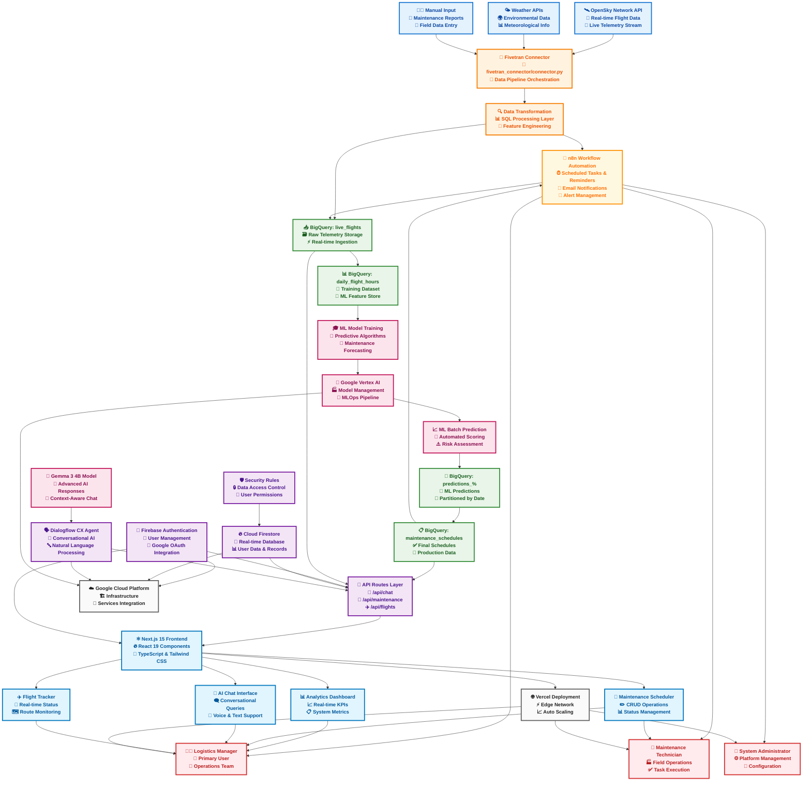
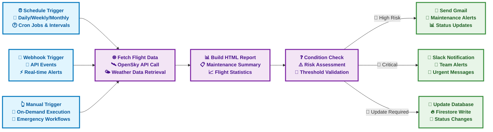
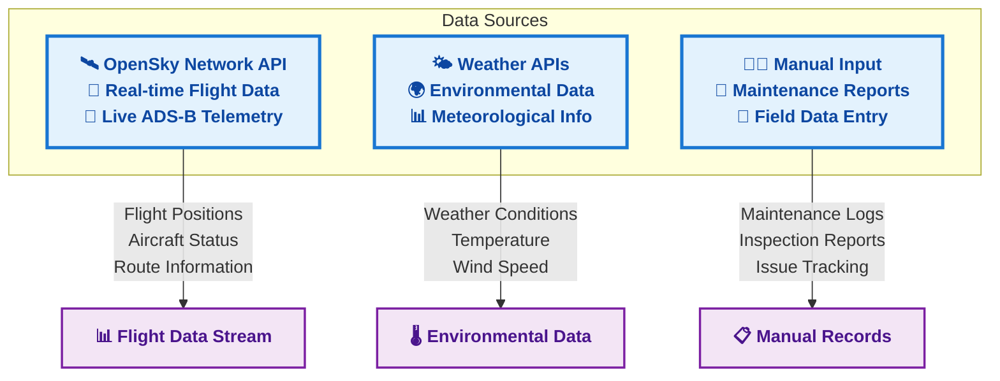
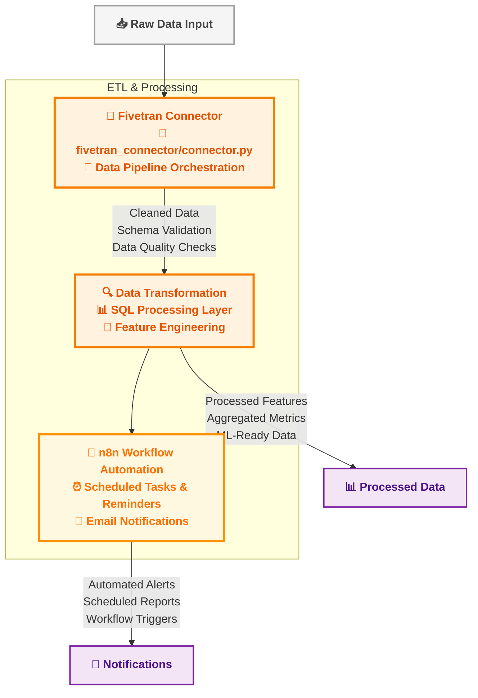
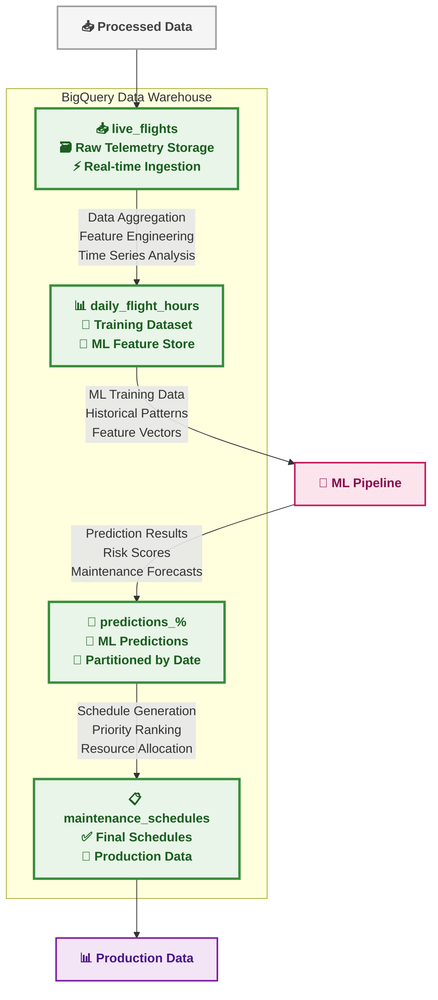
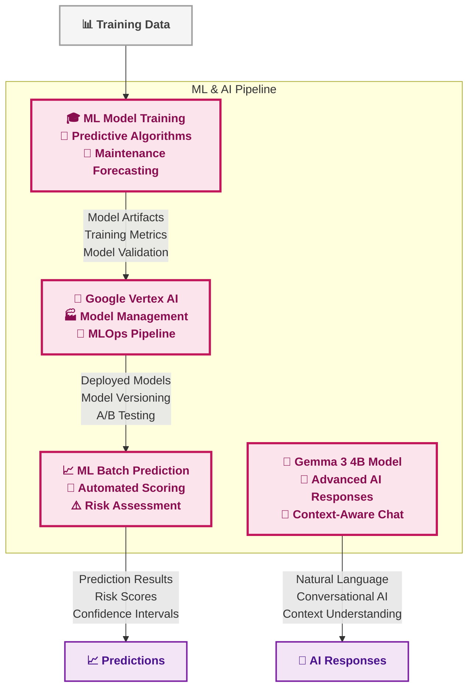
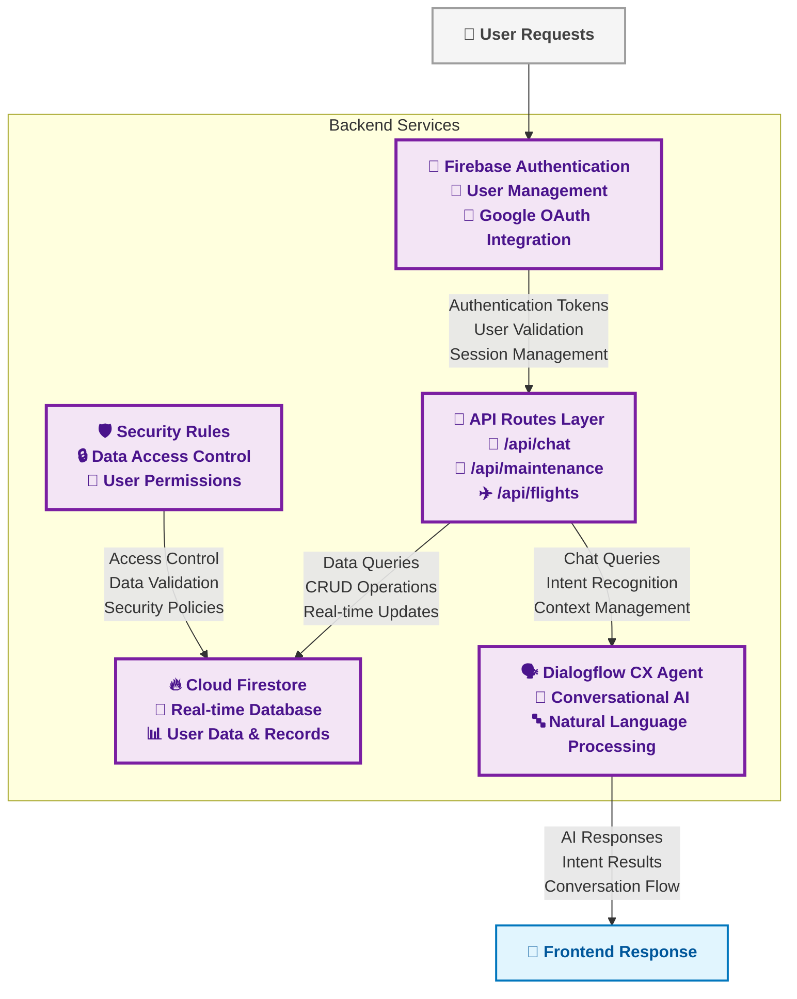
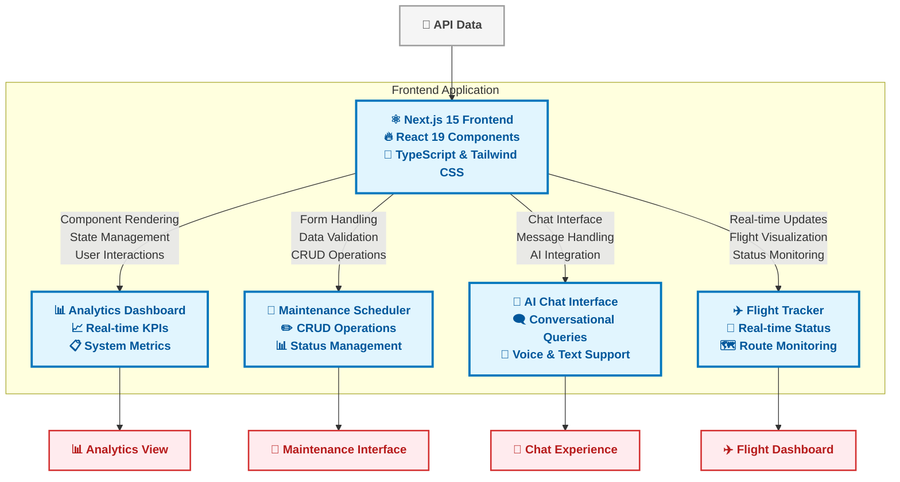
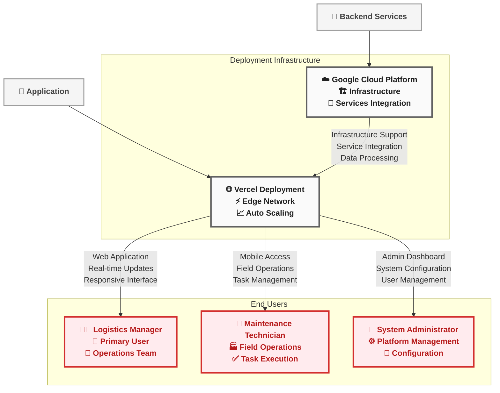

# 🛩️ AeroTrack AI - Predictive Aircraft Maintenance Platform

[](https://vercel.com/new/clone?repository-url=https://github.com/VIDITJAIN7/AeroTrackAI)
[](https://nextjs.org/)
[](https://firebase.google.com/)
[](https://www.typescriptlang.org/)
[](https://tailwindcss.com/)

> **Advanced AI-powered flight management and predictive maintenance scheduling platform with conversational AI assistance**

## 🎯 Overview

AeroTrack AI is a comprehensive flight management platform that combines real-time flight data ingestion, machine learning-powered predictive maintenance, and conversational AI to optimize airline operations. The system provides logistics managers with intelligent insights and automated scheduling capabilities for aircraft maintenance.

## 🏗️ System Architecture

### 📋 **Complete System Overview**
AeroTrack AI is a comprehensive flight management platform with integrated machine learning, conversational AI, and automated workflow management across the entire aviation maintenance lifecycle.



### 🔄 **n8n Workflow Automation Integration**

AeroTrack AI integrates with **n8n** (pronounced "n-eight-n") for powerful workflow automation, scheduled tasks, and intelligent reminder systems that keep your maintenance operations running smoothly.



### 🤖 **Automated Workflow Features**

#### ⏰ **Scheduled Reminders & Tasks**
- **Daily Maintenance Reports**: Automated generation and distribution of maintenance summaries
- **Weekly Risk Assessments**: Comprehensive analysis of upcoming maintenance needs
- **Monthly Performance Reviews**: Statistical reports on maintenance efficiency and aircraft uptime
- **Custom Interval Alerts**: Configurable reminders for specific maintenance milestones

#### 🔔 **Intelligent Alert System**
- **Predictive Maintenance Alerts**: Proactive notifications based on ML predictions
- **Threshold-Based Warnings**: Automated alerts when risk scores exceed defined limits
- **Multi-Channel Notifications**: Email, Slack, SMS, and in-app notifications
- **Escalation Workflows**: Automatic escalation to supervisors for critical issues

#### 📊 **Automated Reporting**
- **HTML Email Reports**: Beautiful, responsive maintenance reports with charts and graphs
- **Executive Dashboards**: High-level summaries for management stakeholders
- **Technical Detailed Reports**: Comprehensive data for maintenance technicians
- **Compliance Documentation**: Automated generation of regulatory compliance reports

#### 🔄 **Workflow Examples**

**1. Daily Maintenance Check Workflow:**
```
⏰ 6:00 AM Daily → 🌐 Fetch Latest Flight Data → 📊 Generate Report → 📧 Email to Team
```

**2. High-Risk Alert Workflow:**
```
🔗 Risk Threshold Exceeded → ❓ Validate Conditions → 💬 Slack Alert → 📧 Email Supervisor
```

**3. Weekly Summary Workflow:**
```
⏰ Monday 9:00 AM → 🌐 Collect Week's Data → 📊 Build Summary → 📧 Send to Management
```

---

## 🔍 **Individual Component Architectures**

### 🌐 **1. Data Sources Layer**



### ⚙️ **2. ETL & Processing Layer**



### 🗄️ **3. Data Warehouse Layer**



### 🤖 **4. Machine Learning & AI Layer**



### 🔧 **5. Backend Services Layer**



### 💻 **6. Frontend & User Interface Layer**



### 🚀 **7. Deployment & Users Layer**



## 🚀 Features

### ✅ **Complete Feature Set**

- **🔍 Advanced Search & Filtering** - Global search, multi-filters, real-time results
- **☑️ Multi-Select Operations** - Bulk actions, visual feedback, persistent selections  
- **🗑️ Data Management** - Full CRUD operations, real-time sync, audit trails
- **🤖 AI-Powered Chat** - Dialogflow CX + Gemma 3 4B, context-aware conversations
- **🔐 Authentication & Security** - Firebase Auth, Google OAuth, granular access control
- **📊 Analytics & Monitoring** - Real-time dashboards, performance tracking, predictive analytics

## 🛠️ Technology Stack

- **Frontend**: Next.js 15, React 19, TypeScript 5, Tailwind CSS 4, Framer Motion
- **Backend**: Firebase 12.5, Cloud Firestore, BigQuery, Google Cloud Functions
- **AI/ML**: Dialogflow CX, Vertex AI, Gemma 3 4B, BigQuery ML, n8n Automation
- **Infrastructure**: Vercel, Google Cloud Platform, Fivetran, OpenSky Network

## 📁 Project Structure

```
flighttrackerAi/
├── src/app/          # Next.js App Router (API routes, pages, layout)
├── src/components/   # React components (auth, chat, dashboard, maintenance)
├── src/contexts/     # React contexts (auth, chat, maintenance state)
├── src/lib/          # Utilities (firebase, dialogflow, helpers)
├── credentials/      # Service account keys
├── public/           # Static assets
└── config files      # package.json, next.config.ts, tailwind.config.js
```

## 🚀 Quick Start

**Prerequisites**: Node.js 18+, Google Cloud Project, Firebase Project

```bash
# 1. Clone & Install
git clone https://github.com/VIDITJAIN7/AeroTrackAI.git
cd AeroTrackAI/flighttrackerAi
npm install

# 2. Environment Setup
cp env.template .env.local
# Configure Firebase, Dialogflow CX, and Google Cloud credentials

# 3. Run Development Server
npm run dev
```

**Setup Requirements**:
- Firebase: Authentication + Firestore + Security Rules
- Google Cloud: Enable Dialogflow API + Service Account
- Dialogflow CX: Create Agent + Configure Intents

Visit [http://localhost:3000](http://localhost:3000)

## 🔧 Configuration

### Firestore Security Rules
```javascript
rules_version = '2';
service cloud.firestore {
  match /databases/{database}/documents {
    match /users/{userId} {
      allow read, write: if request.auth != null && request.auth.uid == userId;
    }
    match /maintenance/{maintenanceId} {
      allow read, write: if request.auth != null && 
        (resource == null || resource.data.userId == request.auth.uid);
    }
  }
}
```

### Dialogflow CX Intents
- **Welcome**: "Hello", "Hi" → "Hello! I'm your flight management assistant."
- **Flight Status**: "Status of flight [number]?" → "Let me check that flight for you."
- **Maintenance**: "Show maintenance schedule" → "I'll pull the maintenance information."

## 🚀 Deployment

### Vercel Deployment
1. **Connect**: Import GitHub repo to [Vercel Dashboard](https://vercel.com/dashboard)
2. **Environment Variables**: Add all `.env.local` variables to Vercel settings
3. **Build Settings**: Framework: Next.js, Build: `npm run build`, Output: `.next`
4. **Deploy**: Push to GitHub → Auto-deployment

```bash
# Test locally before deployment
npm run build && npm start
```

## 🧪 Testing

```bash
# Unit Tests
npm run test

# API Testing
curl -X POST http://localhost:3000/api/chat -H "Content-Type: application/json" \
  -d '{"message": "Hello, can you help me with flight information?"}'

# Firebase Testing  
curl http://localhost:3000/api/test-firebase
```

## 🔍 Troubleshooting

**Common Issues & Solutions**:
- **Authentication Errors**: Check service account JSON file location
- **Firestore Permission Denied**: Update Firestore security rules  
- **Dialogflow Agent Not Found**: Create and configure Dialogflow CX agent
- **Build Failures**: Run `npm run type-check` and `npm run lint:fix`
- **Environment Variables**: Verify `.env.local` exists and restart server

```bash
# Debug Commands
node --version        # Check Node.js 18+
npm run type-check   # Validate TypeScript
npm run build        # Test build
```

## 📊 Performance Optimization

- **Frontend**: Next.js image optimization, code splitting, static generation, edge functions
- **Database**: Firestore indexes, client-side sorting, pagination, strategic caching
- **AI Integration**: Response caching, batch processing, fallback responses, context management

## 🔐 Security

- **Authentication**: Firebase Auth, JWT tokens, Google OAuth, session management
- **Data Security**: Firestore rules, user isolation, input validation, XSS protection
- **API Security**: Rate limiting, CORS configuration, secure credentials, HTTPS enforcement

## 📈 Monitoring & Analytics

- **Application**: Vercel Analytics, error tracking, performance metrics, user insights
- **Database**: Firestore metrics, query performance, storage monitoring, security events  
- **AI Performance**: Response times, success rates, conversation quality, usage patterns

## 🤝 Contributing

1. Fork → Create branch → Make changes → Test → Commit → Push → Create PR
2. **Standards**: TypeScript, ESLint, Prettier, Conventional Commits
3. **Testing**: Unit, Integration, E2E, Performance tests required

## 📚 Resources

- [Next.js Docs](https://nextjs.org/docs) • [Firebase Docs](https://firebase.google.com/docs) • [Dialogflow CX](https://cloud.google.com/dialogflow) • [Vercel Docs](https://vercel.com/docs)

## 📄 License

MIT License - see [LICENSE](LICENSE) file for details.

---

<div align="center">

**🛩️ Built with ❤️ for Aviation Excellence**

[🌐 Live Demo](https://aerotrack-ai.vercel.app) • [🐛 Issues](https://github.com/Hetpatel01021111/MTC_AeroTrackAI/issues) • [✨ Features](https://github.com/Hetpatel01021111/MTC_AeroTrackAI/issues)

</div>
