# 🛩️ AeroTrack AI - Predictive Aircraft Maintenance Platform

[](https://nextjs.org/)
[](https://firebase.google.com/)
[](https://www.typescriptlang.org/)
[](https://tailwindcss.com/)
[](https://cloud.google.com/)
[](https://cloud.google.com/dialogflow)

> **Revolutionary AI-powered aviation maintenance platform combining real-time flight data analysis, machine learning predictions, conversational AI assistance, and automated workflow management to optimize aircraft maintenance operations and enhance aviation safety**

## 🎯 Overview

**AeroTrack AI** represents the next generation of aviation maintenance management, seamlessly integrating cutting-edge artificial intelligence, real-time data processing, and predictive analytics to revolutionize how airlines approach aircraft maintenance operations.

### 🌟 **Core Mission**
Transform traditional reactive maintenance into proactive, data-driven operations that maximize aircraft availability, enhance safety protocols, and optimize operational costs through intelligent automation and predictive insights.

### 🔧 **Key Capabilities**
- **Real-Time Flight Data Integration**: Continuous monitoring of aircraft telemetry from OpenSky Network API
- **Predictive Maintenance Analytics**: Machine learning models forecast maintenance needs before issues occur  
- **Conversational AI Assistant**: Natural language interface powered by Dialogflow CX and Gemma 3 4B
- **Automated Workflow Management**: n8n-powered automation for scheduling, alerts, and reporting
- **Comprehensive Dashboard Analytics**: Real-time KPIs, performance metrics, and operational insights
- **Multi-User Role Management**: Tailored interfaces for logistics managers, technicians, and administrators

## 🏗️ System Architecture

### 📋 **Complete System Overview**
AeroTrack AI is a comprehensive flight management platform with integrated machine learning, conversational AI, and automated workflow management across the entire aviation maintenance lifecycle.

```mermaid
%% ===============================================
%% AeroTrack AI - Complete System Architecture
%% Single Unified View of All Components
%% ===============================================
graph TB
    %% ===== DATA SOURCES =====
    API["🛰️ OpenSky Network API<br/>📡 Real-time Flight Data<br/>🔄 Live Telemetry Stream"]
    WEATHER["🌤️ Weather APIs<br/>🌍 Environmental Data<br/>📊 Meteorological Info"]
    MANUAL["👨‍✈️ Manual Input<br/>📝 Maintenance Reports<br/>🔧 Field Data Entry"]
    
    %% ===== ETL & PROCESSING =====
    FVT["🔄 Fivetran Connector<br/>📂 fivetran_connector/connector.py<br/>🚀 Data Pipeline Orchestration"]
    TRANSFORM["🔍 Data Transformation<br/>📊 SQL Processing Layer<br/>🧮 Feature Engineering"]
    N8N["🤖 n8n Workflow Automation<br/>⏰ Scheduled Tasks & Reminders<br/>📧 Email Notifications<br/>🔔 Alert Management"]
    
    %% ===== DATA WAREHOUSE =====
    BQ_RAW["📥 BigQuery: live_flights<br/>🗃️ Raw Telemetry Storage<br/>⚡ Real-time Ingestion"]
    BQ_TRAIN["📊 BigQuery: daily_flight_hours<br/>🎯 Training Dataset<br/>🏪 ML Feature Store"]
    BQ_PRED["🧮 BigQuery: predictions_%<br/>🔮 ML Predictions<br/>📅 Partitioned by Date"]
    BQ_FINAL["📋 BigQuery: maintenance_schedules<br/>✅ Final Schedules<br/>🚀 Production Data"]
    
    %% ===== MACHINE LEARNING =====
    ML_TRAIN["🎓 ML Model Training<br/>🧠 Predictive Algorithms<br/>🔧 Maintenance Forecasting"]
    VERTEX["🌟 Google Vertex AI<br/>🏭 Model Management<br/>🔄 MLOps Pipeline"]
    ML_PRED["📈 ML Batch Prediction<br/>🎯 Automated Scoring<br/>⚠️ Risk Assessment"]
    GEMMA["🤖 Gemma 3 4B Model<br/>💬 Advanced AI Responses<br/>🧠 Context-Aware Chat"]
    
    %% ===== BACKEND SERVICES =====
    FIREBASE_AUTH["🔐 Firebase Authentication<br/>👤 User Management<br/>🔑 Google OAuth Integration"]
    FIRESTORE["🔥 Cloud Firestore<br/>💾 Real-time Database<br/>📊 User Data & Records"]
    FIREBASE_RULES["🛡️ Security Rules<br/>🔒 Data Access Control<br/>👥 User Permissions"]
    DIALOGFLOW["🗣️ Dialogflow CX Agent<br/>💭 Conversational AI<br/>🔤 Natural Language Processing"]
    API_ROUTES["🔌 API Routes Layer<br/>📡 /api/chat<br/>🔧 /api/maintenance<br/>✈️ /api/flights"]
    
    %% ===== FRONTEND =====
    NEXTJS["⚛️ Next.js 15 Frontend<br/>🔥 React 19 Components<br/>📘 TypeScript & Tailwind CSS"]
    DASHBOARD["📊 Analytics Dashboard<br/>📈 Real-time KPIs<br/>📋 System Metrics"]
    MAINTENANCE["🔧 Maintenance Scheduler<br/>✏️ CRUD Operations<br/>📊 Status Management"]
    CHAT["💬 AI Chat Interface<br/>🗨️ Conversational Queries<br/>🎤 Voice & Text Support"]
    FLIGHTS["✈️ Flight Tracker<br/>📡 Real-time Status<br/>🗺️ Route Monitoring"]
    
    %% ===== DEPLOYMENT & USERS =====
    HOSTING["🌐 Web Hosting Platform<br/>⚡ Edge Network<br/>📈 Auto Scaling"]
    GCP["☁️ Google Cloud Platform<br/>🏗️ Infrastructure<br/>🔗 Services Integration"]
    LOGISTICS["👨‍✈️ Logistics Manager<br/>🎯 Primary User<br/>👥 Operations Team"]
    TECHNICIAN["🔧 Maintenance Technician<br/>🏭 Field Operations<br/>✅ Task Execution"]
    ADMIN["👑 System Administrator<br/>⚙️ Platform Management<br/>🔧 Configuration"]
    
    %% ===== DATA FLOW CONNECTIONS =====
    API --> FVT
    WEATHER --> FVT
    MANUAL --> FVT
    FVT --> TRANSFORM
    TRANSFORM --> N8N
    TRANSFORM --> BQ_RAW
    N8N --> BQ_RAW
    BQ_RAW --> BQ_TRAIN
    BQ_TRAIN --> ML_TRAIN
    ML_TRAIN --> VERTEX
    VERTEX --> ML_PRED
    ML_PRED --> BQ_PRED
    BQ_PRED --> BQ_FINAL
    BQ_FINAL --> API_ROUTES
    BQ_RAW --> API_ROUTES
    GEMMA --> DIALOGFLOW
    FIREBASE_AUTH --> API_ROUTES
    FIRESTORE --> API_ROUTES
    FIREBASE_RULES --> FIRESTORE
    DIALOGFLOW --> API_ROUTES
    API_ROUTES --> NEXTJS
    FIREBASE_AUTH --> NEXTJS
    NEXTJS --> DASHBOARD
    NEXTJS --> MAINTENANCE
    NEXTJS --> CHAT
    NEXTJS --> FLIGHTS
    NEXTJS --> HOSTING
    FIREBASE_AUTH --> GCP
    FIRESTORE --> GCP
    DIALOGFLOW --> GCP
    VERTEX --> GCP
    N8N --> LOGISTICS
    N8N --> TECHNICIAN
    N8N --> ADMIN
    BQ_FINAL --> N8N
    DASHBOARD --> LOGISTICS
    MAINTENANCE --> LOGISTICS
    MAINTENANCE --> TECHNICIAN
    CHAT --> LOGISTICS
    FLIGHTS --> LOGISTICS
    HOSTING --> LOGISTICS
    HOSTING --> TECHNICIAN
    HOSTING --> ADMIN
    
    %% ===== STYLING WITH PERFECT COLORS =====
    classDef dataSource fill:#E3F2FD,stroke:#1976D2,stroke-width:3px,color:#0D47A1,font-weight:bold
    classDef etl fill:#FFF3E0,stroke:#F57C00,stroke-width:3px,color:#E65100,font-weight:bold
    classDef warehouse fill:#E8F5E8,stroke:#388E3C,stroke-width:3px,color:#1B5E20,font-weight:bold
    classDef ml fill:#FCE4EC,stroke:#C2185B,stroke-width:3px,color:#880E4F,font-weight:bold
    classDef backend fill:#F3E5F5,stroke:#7B1FA2,stroke-width:3px,color:#4A148C,font-weight:bold
    classDef frontend fill:#E1F5FE,stroke:#0277BD,stroke-width:3px,color:#01579B,font-weight:bold
    classDef deployment fill:#FAFAFA,stroke:#616161,stroke-width:3px,color:#212121,font-weight:bold
    classDef automation fill:#FFF8E1,stroke:#FF8F00,stroke-width:3px,color:#FF6F00,font-weight:bold
    classDef user fill:#FFEBEE,stroke:#D32F2F,stroke-width:3px,color:#B71C1C,font-weight:bold
    
    %% Apply Styles to Components
    class API,WEATHER,MANUAL dataSource
    class FVT,TRANSFORM etl
    class N8N automation
    class BQ_RAW,BQ_TRAIN,BQ_PRED,BQ_FINAL warehouse
    class ML_TRAIN,ML_PRED,VERTEX,GEMMA ml
    class FIREBASE_AUTH,FIRESTORE,FIREBASE_RULES,DIALOGFLOW,API_ROUTES backend
    class NEXTJS,DASHBOARD,MAINTENANCE,CHAT,FLIGHTS frontend
    class HOSTING,GCP deployment
    class LOGISTICS,TECHNICIAN,ADMIN user
```



### 🔄 **n8n Workflow Automation Integration**

**AeroTrack AI** leverages the power of **n8n** (pronounced "n-eight-n"), an advanced workflow automation platform, to create intelligent, self-managing maintenance operations that operate 24/7 without human intervention.

#### 🎯 **Automation Philosophy**
Transform manual, repetitive maintenance tasks into intelligent, automated workflows that enhance operational efficiency, reduce human error, and ensure critical maintenance activities never fall through the cracks.

#### 🚀 **Advanced Automation Capabilities**
- **Intelligent Scheduling Engine**: Automatically schedules maintenance based on flight hours, calendar intervals, and predictive analytics
- **Multi-Channel Alert System**: Sends notifications via email, Slack, SMS, and in-app messaging based on urgency levels
- **Dynamic Report Generation**: Creates comprehensive HTML reports with charts, graphs, and actionable insights
- **Conditional Logic Processing**: Implements complex business rules and decision trees for maintenance prioritization
- **Integration Hub**: Connects with external systems, APIs, and databases for seamless data flow

```mermaid
%% ===============================================
%% n8n Workflow Automation for AeroTrack AI
%% ===============================================
graph LR
    %% n8n Workflow Triggers
    SCHEDULE["⏰ Schedule Trigger<br/>📅 Daily/Weekly/Monthly<br/>🕐 Cron Jobs & Intervals"]
    WEBHOOK["🔗 Webhook Trigger<br/>📡 API Events<br/>⚡ Real-time Alerts"]
    MANUAL_TRIGGER["👆 Manual Trigger<br/>🚀 On-Demand Execution<br/>🚨 Emergency Workflows"]
    
    %% n8n Processing Nodes
    FETCH_DATA["🌐 Fetch Flight Data<br/>🛰️ OpenSky API Call<br/>🌤️ Weather Data Retrieval"]
    BUILD_REPORT["📊 Build HTML Report<br/>📋 Maintenance Summary<br/>📈 Flight Statistics"]
    CONDITION["❓ Condition Check<br/>⚠️ Risk Assessment<br/>🎯 Threshold Validation"]
    
    %% n8n Output Actions
    SEND_EMAIL["📧 Send Gmail<br/>🔔 Maintenance Alerts<br/>📊 Status Updates"]
    SLACK_NOTIFY["💬 Slack Notification<br/>👥 Team Alerts<br/>🚨 Urgent Messages"]
    UPDATE_DB["💾 Update Database<br/>🔥 Firestore Write<br/>📝 Status Changes"]
    
    %% Workflow Connections
    SCHEDULE --> FETCH_DATA
    WEBHOOK --> FETCH_DATA
    MANUAL_TRIGGER --> FETCH_DATA
    
    FETCH_DATA --> BUILD_REPORT
    BUILD_REPORT --> CONDITION
    
    CONDITION -->|🔴 High Risk| SEND_EMAIL
    CONDITION -->|🚨 Critical| SLACK_NOTIFY
    CONDITION -->|📝 Update Required| UPDATE_DB
    
    %% Styling
    classDef trigger fill:#E1F5FE,stroke:#0277BD,stroke-width:3px,color:#01579B,font-weight:bold
    classDef process fill:#F3E5F5,stroke:#7B1FA2,stroke-width:3px,color:#4A148C,font-weight:bold
    classDef output fill:#E8F5E8,stroke:#388E3C,stroke-width:3px,color:#1B5E20,font-weight:bold
    
    class SCHEDULE,WEBHOOK,MANUAL_TRIGGER trigger
    class FETCH_DATA,BUILD_REPORT,CONDITION process
    class SEND_EMAIL,SLACK_NOTIFY,UPDATE_DB output
```



### 🤖 **Automated Workflow Features**

#### ⏰ **Scheduled Reminders & Tasks**
- **Daily Maintenance Reports**: Automated generation and distribution of maintenance summaries
- **Weekly Risk Assessments**: Comprehensive analysis of upcoming maintenance needs
- **Monthly Performance Reviews**: Statistical reports on maintenance efficiency and aircraft uptime
- **Custom Interval Alerts**: Configurable reminders for specific maintenance milestones

#### 🔔 **Intelligent Alert System**
- **Predictive Maintenance Alerts**: Proactive notifications based on ML predictions
- **Threshold-Based Warnings**: Automated alerts when risk scores exceed defined limits
- **Multi-Channel Notifications**: Email, Slack, SMS, and in-app notifications
- **Escalation Workflows**: Automatic escalation to supervisors for critical issues

#### 📊 **Automated Reporting**
- **HTML Email Reports**: Beautiful, responsive maintenance reports with charts and graphs
- **Executive Dashboards**: High-level summaries for management stakeholders
- **Technical Detailed Reports**: Comprehensive data for maintenance technicians
- **Compliance Documentation**: Automated generation of regulatory compliance reports

#### 🔄 **Workflow Examples**

**1. Daily Maintenance Check Workflow:**
```
⏰ 6:00 AM Daily → 🌐 Fetch Latest Flight Data → 📊 Generate Report → 📧 Email to Team
```

**2. High-Risk Alert Workflow:**
```
🔗 Risk Threshold Exceeded → ❓ Validate Conditions → 💬 Slack Alert → 📧 Email Supervisor
```

**3. Weekly Summary Workflow:**
```
⏰ Monday 9:00 AM → 🌐 Collect Week's Data → 📊 Build Summary → 📧 Send to Management
```

---

## 🔍 **Individual Component Architectures**

### 🌐 **1. Data Sources Layer**

```mermaid
graph TB
    subgraph "Data Sources"
        API["🛰️ OpenSky Network API<br/>📡 Real-time Flight Data<br/>🔄 Live ADS-B Telemetry"]
        WEATHER["🌤️ Weather APIs<br/>🌍 Environmental Data<br/>📊 Meteorological Info"]
        MANUAL["👨‍✈️ Manual Input<br/>📝 Maintenance Reports<br/>🔧 Field Data Entry"]
    end
    
    API --> |"Flight Positions<br/>Aircraft Status<br/>Route Information"| OUTPUT1["📊 Flight Data Stream"]
    WEATHER --> |"Weather Conditions<br/>Temperature<br/>Wind Speed"| OUTPUT2["🌡️ Environmental Data"]
    MANUAL --> |"Maintenance Logs<br/>Inspection Reports<br/>Issue Tracking"| OUTPUT3["📋 Manual Records"]
    
    classDef dataSource fill:#E3F2FD,stroke:#1976D2,stroke-width:3px,color:#0D47A1,font-weight:bold
    classDef output fill:#F3E5F5,stroke:#7B1FA2,stroke-width:2px,color:#4A148C,font-weight:bold
    
    class API,WEATHER,MANUAL dataSource
    class OUTPUT1,OUTPUT2,OUTPUT3 output
```



### ⚙️ **2. ETL & Processing Layer**

```mermaid
graph TB
    subgraph "ETL & Processing"
        FVT["🔄 Fivetran Connector<br/>📂 fivetran_connector/connector.py<br/>🚀 Data Pipeline Orchestration"]
        TRANSFORM["🔍 Data Transformation<br/>📊 SQL Processing Layer<br/>🧮 Feature Engineering"]
        N8N["🤖 n8n Workflow Automation<br/>⏰ Scheduled Tasks & Reminders<br/>📧 Email Notifications"]
    end
    
    INPUT["📥 Raw Data Input"] --> FVT
    FVT --> |"Cleaned Data<br/>Schema Validation<br/>Data Quality Checks"| TRANSFORM
    TRANSFORM --> |"Processed Features<br/>Aggregated Metrics<br/>ML-Ready Data"| OUTPUT1["📊 Processed Data"]
    TRANSFORM --> N8N
    N8N --> |"Automated Alerts<br/>Scheduled Reports<br/>Workflow Triggers"| OUTPUT2["🔔 Notifications"]
    
    classDef etl fill:#FFF3E0,stroke:#F57C00,stroke-width:3px,color:#E65100,font-weight:bold
    classDef automation fill:#FFF8E1,stroke:#FF8F00,stroke-width:3px,color:#FF6F00,font-weight:bold
    classDef input fill:#F5F5F5,stroke:#9E9E9E,stroke-width:2px,color:#424242,font-weight:bold
    classDef output fill:#F3E5F5,stroke:#7B1FA2,stroke-width:2px,color:#4A148C,font-weight:bold
    
    class FVT,TRANSFORM etl
    class N8N automation
    class INPUT input
    class OUTPUT1,OUTPUT2 output
```



### 🗄️ **3. Data Warehouse Layer**

```mermaid
graph TB
    subgraph "BigQuery Data Warehouse"
        BQ_RAW["📥 live_flights<br/>🗃️ Raw Telemetry Storage<br/>⚡ Real-time Ingestion"]
        BQ_TRAIN["📊 daily_flight_hours<br/>🎯 Training Dataset<br/>🏪 ML Feature Store"]
        BQ_PRED["🧮 predictions_%<br/>🔮 ML Predictions<br/>📅 Partitioned by Date"]
        BQ_FINAL["📋 maintenance_schedules<br/>✅ Final Schedules<br/>🚀 Production Data"]
    end
    
    INPUT["📥 Processed Data"] --> BQ_RAW
    BQ_RAW --> |"Data Aggregation<br/>Feature Engineering<br/>Time Series Analysis"| BQ_TRAIN
    BQ_TRAIN --> |"ML Training Data<br/>Historical Patterns<br/>Feature Vectors"| ML_INPUT["🤖 ML Pipeline"]
    ML_INPUT --> |"Prediction Results<br/>Risk Scores<br/>Maintenance Forecasts"| BQ_PRED
    BQ_PRED --> |"Schedule Generation<br/>Priority Ranking<br/>Resource Allocation"| BQ_FINAL
    BQ_FINAL --> OUTPUT["📊 Production Data"]
    
    classDef warehouse fill:#E8F5E8,stroke:#388E3C,stroke-width:3px,color:#1B5E20,font-weight:bold
    classDef ml fill:#FCE4EC,stroke:#C2185B,stroke-width:2px,color:#880E4F,font-weight:bold
    classDef input fill:#F5F5F5,stroke:#9E9E9E,stroke-width:2px,color:#424242,font-weight:bold
    classDef output fill:#F3E5F5,stroke:#7B1FA2,stroke-width:2px,color:#4A148C,font-weight:bold
    
    class BQ_RAW,BQ_TRAIN,BQ_PRED,BQ_FINAL warehouse
    class ML_INPUT ml
    class INPUT input
    class OUTPUT output
```



### 🤖 **4. Machine Learning & AI Layer**

```mermaid
graph TB
    subgraph "ML & AI Pipeline"
        ML_TRAIN["🎓 ML Model Training<br/>🧠 Predictive Algorithms<br/>🔧 Maintenance Forecasting"]
        VERTEX["🌟 Google Vertex AI<br/>🏭 Model Management<br/>🔄 MLOps Pipeline"]
        ML_PRED["📈 ML Batch Prediction<br/>🎯 Automated Scoring<br/>⚠️ Risk Assessment"]
        GEMMA["🤖 Gemma 3 4B Model<br/>💬 Advanced AI Responses<br/>🧠 Context-Aware Chat"]
    end
    
    INPUT["📊 Training Data"] --> ML_TRAIN
    ML_TRAIN --> |"Model Artifacts<br/>Training Metrics<br/>Model Validation"| VERTEX
    VERTEX --> |"Deployed Models<br/>Model Versioning<br/>A/B Testing"| ML_PRED
    ML_PRED --> |"Prediction Results<br/>Risk Scores<br/>Confidence Intervals"| OUTPUT1["📈 Predictions"]
    GEMMA --> |"Natural Language<br/>Conversational AI<br/>Context Understanding"| OUTPUT2["💬 AI Responses"]
    
    classDef ml fill:#FCE4EC,stroke:#C2185B,stroke-width:3px,color:#880E4F,font-weight:bold
    classDef input fill:#F5F5F5,stroke:#9E9E9E,stroke-width:2px,color:#424242,font-weight:bold
    classDef output fill:#F3E5F5,stroke:#7B1FA2,stroke-width:2px,color:#4A148C,font-weight:bold
    
    class ML_TRAIN,VERTEX,ML_PRED,GEMMA ml
    class INPUT input
    class OUTPUT1,OUTPUT2 output
```



### 🔧 **5. Backend Services Layer**

```mermaid
graph TB
    subgraph "Backend Services"
        FIREBASE_AUTH["🔐 Firebase Authentication<br/>👤 User Management<br/>🔑 Google OAuth Integration"]
        FIRESTORE["🔥 Cloud Firestore<br/>💾 Real-time Database<br/>📊 User Data & Records"]
        FIREBASE_RULES["🛡️ Security Rules<br/>🔒 Data Access Control<br/>👥 User Permissions"]
        DIALOGFLOW["🗣️ Dialogflow CX Agent<br/>💭 Conversational AI<br/>🔤 Natural Language Processing"]
        API_ROUTES["🔌 API Routes Layer<br/>📡 /api/chat<br/>🔧 /api/maintenance<br/>✈️ /api/flights"]
    end
    
    USER_INPUT["👤 User Requests"] --> FIREBASE_AUTH
    FIREBASE_AUTH --> |"Authentication Tokens<br/>User Validation<br/>Session Management"| API_ROUTES
    API_ROUTES --> |"Data Queries<br/>CRUD Operations<br/>Real-time Updates"| FIRESTORE
    FIREBASE_RULES --> |"Access Control<br/>Data Validation<br/>Security Policies"| FIRESTORE
    API_ROUTES --> |"Chat Queries<br/>Intent Recognition<br/>Context Management"| DIALOGFLOW
    DIALOGFLOW --> |"AI Responses<br/>Intent Results<br/>Conversation Flow"| OUTPUT["📱 Frontend Response"]
    
    classDef backend fill:#F3E5F5,stroke:#7B1FA2,stroke-width:3px,color:#4A148C,font-weight:bold
    classDef input fill:#F5F5F5,stroke:#9E9E9E,stroke-width:2px,color:#424242,font-weight:bold
    classDef output fill:#E1F5FE,stroke:#0277BD,stroke-width:2px,color:#01579B,font-weight:bold
    
    class FIREBASE_AUTH,FIRESTORE,FIREBASE_RULES,DIALOGFLOW,API_ROUTES backend
    class USER_INPUT input
    class OUTPUT output
```



### 💻 **6. Frontend & User Interface Layer**

```mermaid
graph TB
    subgraph "Frontend Application"
        NEXTJS["⚛️ Next.js 15 Frontend<br/>🔥 React 19 Components<br/>📘 TypeScript & Tailwind CSS"]
        DASHBOARD["📊 Analytics Dashboard<br/>📈 Real-time KPIs<br/>📋 System Metrics"]
        MAINTENANCE["🔧 Maintenance Scheduler<br/>✏️ CRUD Operations<br/>📊 Status Management"]
        CHAT["💬 AI Chat Interface<br/>🗨️ Conversational Queries<br/>🎤 Voice & Text Support"]
        FLIGHTS["✈️ Flight Tracker<br/>📡 Real-time Status<br/>🗺️ Route Monitoring"]
    end
    
    API_INPUT["🔌 API Data"] --> NEXTJS
    NEXTJS --> |"Component Rendering<br/>State Management<br/>User Interactions"| DASHBOARD
    NEXTJS --> |"Form Handling<br/>Data Validation<br/>CRUD Operations"| MAINTENANCE
    NEXTJS --> |"Chat Interface<br/>Message Handling<br/>AI Integration"| CHAT
    NEXTJS --> |"Real-time Updates<br/>Flight Visualization<br/>Status Monitoring"| FLIGHTS
    
    DASHBOARD --> OUTPUT1["📊 Analytics View"]
    MAINTENANCE --> OUTPUT2["🔧 Maintenance Interface"]
    CHAT --> OUTPUT3["💬 Chat Experience"]
    FLIGHTS --> OUTPUT4["✈️ Flight Dashboard"]
    
    classDef frontend fill:#E1F5FE,stroke:#0277BD,stroke-width:3px,color:#01579B,font-weight:bold
    classDef input fill:#F5F5F5,stroke:#9E9E9E,stroke-width:2px,color:#424242,font-weight:bold
    classDef output fill:#FFEBEE,stroke:#D32F2F,stroke-width:2px,color:#B71C1C,font-weight:bold
    
    class NEXTJS,DASHBOARD,MAINTENANCE,CHAT,FLIGHTS frontend
    class API_INPUT input
    class OUTPUT1,OUTPUT2,OUTPUT3,OUTPUT4 output
```



### 🚀 **7. Deployment & Users Layer**

```mermaid
graph TB
    subgraph "Deployment Infrastructure"
        HOSTING["🌐 Web Hosting Platform<br/>⚡ Edge Network<br/>📈 Auto Scaling"]
        GCP["☁️ Google Cloud Platform<br/>🏗️ Infrastructure<br/>🔗 Services Integration"]
    end
    
    subgraph "End Users"
        LOGISTICS["👨‍✈️ Logistics Manager<br/>🎯 Primary User<br/>👥 Operations Team"]
        TECHNICIAN["🔧 Maintenance Technician<br/>🏭 Field Operations<br/>✅ Task Execution"]
        ADMIN["👑 System Administrator<br/>⚙️ Platform Management<br/>🔧 Configuration"]
    end
    
    APP_INPUT["📱 Application"] --> HOSTING
    SERVICES_INPUT["🔧 Backend Services"] --> GCP
    
    HOSTING --> |"Web Application<br/>Real-time Updates<br/>Responsive Interface"| LOGISTICS
    HOSTING --> |"Mobile Access<br/>Field Operations<br/>Task Management"| TECHNICIAN
    HOSTING --> |"Admin Dashboard<br/>System Configuration<br/>User Management"| ADMIN
    
    GCP --> |"Infrastructure Support<br/>Service Integration<br/>Data Processing"| HOSTING
    
    classDef deployment fill:#FAFAFA,stroke:#616161,stroke-width:3px,color:#212121,font-weight:bold
    classDef user fill:#FFEBEE,stroke:#D32F2F,stroke-width:3px,color:#B71C1C,font-weight:bold
    classDef input fill:#F5F5F5,stroke:#9E9E9E,stroke-width:2px,color:#424242,font-weight:bold
    
    class HOSTING,GCP deployment
    class LOGISTICS,TECHNICIAN,ADMIN user
    class APP_INPUT,SERVICES_INPUT input
```



## 🚀 Features & Capabilities

### ✅ **Comprehensive Feature Ecosystem**

#### 🔍 **Advanced Search & Filtering System**
- **Global Search Engine**: Intelligent search across flight numbers, aircraft types, maintenance records, user profiles, and historical data
- **Multi-Dimensional Filtering**: Filter by maintenance status, aircraft type, date ranges, priority levels, technician assignments, and completion status
- **Real-Time Results**: Instant search results with live updates as data changes
- **Smart Suggestions**: Auto-complete functionality with search history and predictive text
- **Saved Search Profiles**: Create and save custom search configurations for repeated use
- **Advanced Query Builder**: Complex search queries with AND/OR logic and nested conditions

#### ☑️ **Multi-Select Operations & Bulk Management**
- **Intelligent Bulk Actions**: Select multiple maintenance entries for batch operations with smart validation
- **Visual Selection Feedback**: Clear indicators showing selected items with count displays and progress tracking
- **Persistent Selection State**: Maintain selections across page navigation and filter changes
- **Conditional Bulk Operations**: Different actions available based on selected item types and statuses
- **Batch Status Updates**: Simultaneously update multiple maintenance records with validation checks
- **Mass Assignment Tools**: Assign multiple tasks to technicians or reschedule multiple maintenance activities

#### 🗑️ **Comprehensive Data Management**
- **Full CRUD Operations**: Complete Create, Read, Update, Delete functionality with role-based permissions
- **Real-Time Synchronization**: Instant data updates across all connected devices and user sessions
- **Comprehensive Audit Trails**: Track all changes with timestamps, user attribution, and change history
- **Data Validation Engine**: Server-side and client-side validation with custom business rules
- **Backup & Recovery**: Automated data backups with point-in-time recovery capabilities
- **Data Export/Import**: Support for various formats including CSV, Excel, JSON, and PDF reports

#### 🤖 **AI-Powered Conversational Assistant**
- **Advanced Natural Language Processing**: Powered by Dialogflow CX and Gemma 3 4B for sophisticated conversation handling
- **Context-Aware Interactions**: Maintains conversation history and understands complex, multi-turn dialogues
- **Multi-Modal Communication**: Support for text, voice commands, and visual query interfaces
- **Intelligent Intent Recognition**: Accurately interprets user requests and provides relevant maintenance information
- **Proactive Assistance**: AI suggests maintenance actions based on patterns and predictive analytics
- **Learning Capabilities**: Continuously improves responses based on user interactions and feedback

#### 🔐 **Enterprise-Grade Security & Authentication**
- **Multi-Factor Authentication**: Firebase Authentication with email/password, Google OAuth, and optional 2FA
- **Role-Based Access Control**: Granular permissions for administrators, logistics managers, and technicians
- **Session Management**: Secure token handling with automatic refresh and timeout protection
- **Data Encryption**: End-to-end encryption for sensitive maintenance data and communications
- **Audit Logging**: Comprehensive security event logging with anomaly detection
- **Compliance Ready**: Meets aviation industry security standards and regulatory requirements

#### 📊 **Advanced Analytics & Business Intelligence**
- **Real-Time Dashboards**: Live KPIs including aircraft availability, maintenance completion rates, and cost analytics
- **Predictive Analytics Engine**: Machine learning models forecast maintenance needs and optimize scheduling
- **Performance Tracking**: Monitor technician productivity, maintenance quality metrics, and operational efficiency
- **Custom Report Builder**: Create tailored reports with drag-and-drop interface and scheduled delivery
- **Trend Analysis**: Historical data analysis with pattern recognition and anomaly detection
- **Cost Optimization**: Track maintenance costs, parts inventory, and resource utilization for budget optimization

## 🛠️ Advanced Technology Stack

### 🎨 **Frontend Technologies**
- **Next.js 15.5.6**: Latest React framework with App Router, server components, and edge runtime optimization
- **React 19.1.0**: Modern React with concurrent features, automatic batching, and enhanced performance
- **TypeScript 5.0**: Strict type safety with advanced type inference and developer experience enhancements
- **Tailwind CSS 4.0**: Utility-first CSS framework with custom design system and responsive components
- **Framer Motion 12.23**: Advanced animations, gestures, and smooth transitions for enhanced UX
- **Lucide React**: Modern, customizable icon library with 1000+ professionally designed icons

### 🔧 **Backend & Database Infrastructure**
- **Firebase 12.5.0**: Comprehensive Backend-as-a-Service with real-time capabilities and global CDN
- **Cloud Firestore**: NoSQL document database with real-time synchronization and offline support
- **Firebase Authentication**: Enterprise-grade user management with multi-provider support
- **BigQuery**: Petabyte-scale data warehouse for analytics and machine learning workloads
- **Google Cloud Functions**: Serverless computing platform for scalable backend operations
- **Cloud Storage**: Secure file storage with global distribution and automatic backup

### 🤖 **AI & Machine Learning Platform**
- **Dialogflow CX**: Advanced conversational AI with visual flow builder and enterprise features
- **Google Vertex AI**: Unified ML platform for model training, deployment, and management
- **Gemma 3 4B Model**: State-of-the-art large language model for natural language understanding
- **BigQuery ML**: In-database machine learning for predictive analytics and data insights
- **n8n Workflow Automation**: Visual workflow builder for complex business process automation
- **TensorFlow**: Open-source machine learning framework for custom model development

### 🌐 **Infrastructure & Deployment**
- **Google Cloud Platform**: Enterprise cloud infrastructure with global presence and 99.99% uptime
- **Cloud Run**: Fully managed serverless platform for containerized applications
- **Cloud CDN**: Global content delivery network for optimal performance worldwide
- **Fivetran**: Automated data pipeline platform for reliable ETL operations
- **OpenSky Network**: Real-time flight data API with comprehensive aircraft tracking
- **Cloud Monitoring**: Advanced observability and alerting for system health monitoring

## 📁 Project Structure

```
flighttrackerAi/
├── src/app/          # Next.js App Router (API routes, pages, layout)
├── src/components/   # React components (auth, chat, dashboard, maintenance)
├── src/contexts/     # React contexts (auth, chat, maintenance state)
├── src/lib/          # Utilities (firebase, dialogflow, helpers)
├── credentials/      # Service account keys
├── public/           # Static assets
└── config files      # package.json, next.config.ts, tailwind.config.js
```

## 🚀 Quick Start

**Prerequisites**: Node.js 18+, Google Cloud Project, Firebase Project

```bash
# 1. Clone & Install
git clone https://github.com/VIDITJAIN7/AeroTrackAI.git
cd AeroTrackAI/flighttrackerAi
npm install

# 2. Environment Setup
cp env.template .env.local
# Configure Firebase, Dialogflow CX, and Google Cloud credentials

# 3. Run Development Server
npm run dev
```

**Setup Requirements**:
- Firebase: Authentication + Firestore + Security Rules
- Google Cloud: Enable Dialogflow API + Service Account
- Dialogflow CX: Create Agent + Configure Intents

Visit [http://localhost:3000](http://localhost:3000)

## 🔧 Configuration

### Firestore Security Rules
```javascript
rules_version = '2';
service cloud.firestore {
  match /databases/{database}/documents {
    match /users/{userId} {
      allow read, write: if request.auth != null && request.auth.uid == userId;
    }
    match /maintenance/{maintenanceId} {
      allow read, write: if request.auth != null && 
        (resource == null || resource.data.userId == request.auth.uid);
    }
  }
}
```

### Dialogflow CX Intents
- **Welcome**: "Hello", "Hi" → "Hello! I'm your flight management assistant."
- **Flight Status**: "Status of flight [number]?" → "Let me check that flight for you."
- **Maintenance**: "Show maintenance schedule" → "I'll pull the maintenance information."

## 🚀 Deployment & Production Setup

### 🌐 **Production Deployment Options**

#### **Option 1: Google Cloud Platform (Recommended)**
```bash
# 1. Build for production
npm run build

# 2. Deploy to Cloud Run
gcloud run deploy aerotrack-ai \
  --source . \
  --platform managed \
  --region us-central1 \
  --allow-unauthenticated

# 3. Configure custom domain
gcloud run domain-mappings create \
  --service aerotrack-ai \
  --domain your-domain.com
```

#### **Option 2: Docker Containerization**
```bash
# 1. Build Docker image
docker build -t aerotrack-ai .

# 2. Run container locally
docker run -p 3000:3000 aerotrack-ai

# 3. Deploy to any container platform
docker push your-registry/aerotrack-ai
```

#### **Option 3: Traditional Web Hosting**
```bash
# 1. Build static export
npm run build
npm run export

# 2. Upload dist folder to web server
# 3. Configure web server for SPA routing
```

### ⚙️ **Environment Configuration**
Ensure all production environment variables are properly configured:
- Firebase configuration and service accounts
- Google Cloud credentials and project settings
- Dialogflow CX agent configuration
- Database connection strings and API keys
- Security certificates and domain settings

## 🧪 Testing

```bash
# Unit Tests
npm run test

# API Testing
curl -X POST http://localhost:3000/api/chat -H "Content-Type: application/json" \
  -d '{"message": "Hello, can you help me with flight information?"}'

# Firebase Testing  
curl http://localhost:3000/api/test-firebase
```

## 🔍 Troubleshooting

**Common Issues & Solutions**:
- **Authentication Errors**: Check service account JSON file location
- **Firestore Permission Denied**: Update Firestore security rules  
- **Dialogflow Agent Not Found**: Create and configure Dialogflow CX agent
- **Build Failures**: Run `npm run type-check` and `npm run lint:fix`
- **Environment Variables**: Verify `.env.local` exists and restart server

```bash
# Debug Commands
node --version        # Check Node.js 18+
npm run type-check   # Validate TypeScript
npm run build        # Test build
```

## 📊 Performance Optimization

- **Frontend**: Next.js image optimization, code splitting, static generation, edge functions
- **Database**: Firestore indexes, client-side sorting, pagination, strategic caching
- **AI Integration**: Response caching, batch processing, fallback responses, context management

## 🔐 Security

- **Authentication**: Firebase Auth, JWT tokens, Google OAuth, session management
- **Data Security**: Firestore rules, user isolation, input validation, XSS protection
- **API Security**: Rate limiting, CORS configuration, secure credentials, HTTPS enforcement

## 📈 Comprehensive Monitoring & Analytics

### 🔍 **Application Performance Monitoring**
- **Real-Time Performance Metrics**: Monitor Core Web Vitals, page load times, and user interaction metrics
- **Advanced Error Tracking**: Comprehensive error logging with stack traces, user context, and automatic alerting
- **User Experience Analytics**: Track user journeys, feature adoption rates, and engagement patterns
- **Performance Optimization**: Identify bottlenecks, optimize resource loading, and enhance user experience
- **Uptime Monitoring**: 24/7 availability monitoring with instant notifications for service disruptions

### 💾 **Database & Infrastructure Monitoring**
- **Firestore Performance Metrics**: Monitor read/write operations, query performance, and connection pooling
- **Storage Optimization**: Track database size growth, index usage, and query optimization opportunities
- **Security Event Monitoring**: Real-time detection of suspicious activities and access pattern anomalies
- **Resource Utilization**: Monitor CPU, memory, and network usage across all infrastructure components
- **Cost Analytics**: Track cloud resource costs and optimize spending with usage-based recommendations

### 🤖 **AI & Machine Learning Performance**
- **Conversation Quality Metrics**: Analyze AI response accuracy, user satisfaction, and conversation completion rates
- **Model Performance Tracking**: Monitor prediction accuracy, inference times, and model drift detection
- **Usage Pattern Analysis**: Identify popular queries, peak usage times, and feature utilization trends
- **Continuous Learning**: Implement feedback loops to improve AI responses and user experience
- **Predictive Analytics**: Forecast maintenance needs and optimize resource allocation based on historical data

## 🤝 Contributing

1. Fork → Create branch → Make changes → Test → Commit → Push → Create PR
2. **Standards**: TypeScript, ESLint, Prettier, Conventional Commits
3. **Testing**: Unit, Integration, E2E, Performance tests required

## 📚 Comprehensive Resources & Documentation

### 🔗 **Official Documentation**
- **[Next.js Documentation](https://nextjs.org/docs)**: Complete guide to React framework features and best practices
- **[Firebase Documentation](https://firebase.google.com/docs)**: Backend services, authentication, and database management
- **[Dialogflow CX](https://cloud.google.com/dialogflow)**: Conversational AI platform and natural language processing
- **[Google Cloud Platform](https://cloud.google.com/docs)**: Infrastructure, deployment, and cloud services
- **[TypeScript Handbook](https://www.typescriptlang.org/docs)**: Type-safe development and advanced TypeScript features
- **[Tailwind CSS](https://tailwindcss.com/docs)**: Utility-first CSS framework and component design

### 🎓 **Learning Resources**
- **[React 19 Features](https://react.dev/blog)**: Latest React capabilities and concurrent features
- **[Machine Learning with BigQuery](https://cloud.google.com/bigquery-ml/docs)**: In-database ML and predictive analytics
- **[n8n Workflow Automation](https://docs.n8n.io)**: Visual workflow builder and automation best practices
- **[Aviation Industry Standards](https://www.icao.int)**: International aviation regulations and compliance requirements

### 🛠️ **Development Tools**
- **[VS Code Extensions](https://marketplace.visualstudio.com)**: Recommended extensions for optimal development experience
- **[Chrome DevTools](https://developers.google.com/web/tools/chrome-devtools)**: Debugging and performance optimization
- **[Firebase Emulator Suite](https://firebase.google.com/docs/emulator-suite)**: Local development and testing environment
- **[Postman Collections](https://www.postman.com)**: API testing and documentation tools

## 📄 License & Legal

**MIT License** - This project is open source and available under the MIT License. See the [LICENSE](LICENSE) file for complete details and terms of use.

### 🔒 **Compliance & Certifications**
- **Aviation Industry Standards**: Compliant with ICAO and FAA maintenance documentation requirements
- **Data Protection**: GDPR and CCPA compliant data handling and privacy protection
- **Security Standards**: SOC 2 Type II and ISO 27001 security framework implementation
- **Accessibility**: WCAG 2.1 AA compliance for inclusive user experience

---

<div align="center">

## 🛩️ **AeroTrack AI - Revolutionizing Aviation Maintenance**

### *Transforming Aircraft Maintenance Through Intelligent Automation*

**🚀 Enterprise-Ready** • **🔒 Security-First** • **🤖 AI-Powered** • **📊 Data-Driven**

---

**[📧 Contact Support](mailto:support@aerotrack-ai.com)** • **[🐛 Report Issues](https://github.com/Hetpatel01021111/MTC_AeroTrackAI/issues)** • **[✨ Request Features](https://github.com/Hetpatel01021111/MTC_AeroTrackAI/discussions)**

---

*Built with passion for aviation excellence and powered by cutting-edge technology*

</div>
