# 🛩️ AeroTrack AI - Predictive Aircraft Maintenance Platform

[](https://vercel.com/new/clone?repository-url=https://github.com/VIDITJAIN7/AeroTrackAI)
[](https://nextjs.org/)
[](https://firebase.google.com/)
[](https://www.typescriptlang.org/)
[](https://tailwindcss.com/)

> **Advanced AI-powered flight management and predictive maintenance scheduling platform with conversational AI assistance**

## 🎯 Overview

AeroTrack AI is a comprehensive flight management platform that combines real-time flight data ingestion, machine learning-powered predictive maintenance, and conversational AI to optimize airline operations. The system provides logistics managers with intelligent insights and automated scheduling capabilities for aircraft maintenance.

## 🏗️ System Architecture

### 📋 **Complete System Overview**
AeroTrack AI is a comprehensive flight management platform with integrated machine learning, conversational AI, and automated workflow management across the entire aviation maintenance lifecycle.

```mermaid
%% ===============================================
%% AeroTrack AI - Complete System Architecture
%% Single Unified View of All Components
%% ===============================================
graph TB
    %% ===== DATA SOURCES =====
    API["🛰️ OpenSky Network API<br/>📡 Real-time Flight Data<br/>🔄 Live Telemetry Stream"]
    WEATHER["🌤️ Weather APIs<br/>🌍 Environmental Data<br/>📊 Meteorological Info"]
    MANUAL["👨‍✈️ Manual Input<br/>📝 Maintenance Reports<br/>🔧 Field Data Entry"]
    
    %% ===== ETL & PROCESSING =====
    FVT["🔄 Fivetran Connector<br/>📂 fivetran_connector/connector.py<br/>🚀 Data Pipeline Orchestration"]
    TRANSFORM["🔍 Data Transformation<br/>📊 SQL Processing Layer<br/>🧮 Feature Engineering"]
    N8N["🤖 n8n Workflow Automation<br/>⏰ Scheduled Tasks & Reminders<br/>📧 Email Notifications<br/>🔔 Alert Management"]
    
    %% ===== DATA WAREHOUSE =====
    BQ_RAW["📥 BigQuery: live_flights<br/>🗃️ Raw Telemetry Storage<br/>⚡ Real-time Ingestion"]
    BQ_TRAIN["📊 BigQuery: daily_flight_hours<br/>🎯 Training Dataset<br/>🏪 ML Feature Store"]
    BQ_PRED["🧮 BigQuery: predictions_%<br/>🔮 ML Predictions<br/>📅 Partitioned by Date"]
    BQ_FINAL["📋 BigQuery: maintenance_schedules<br/>✅ Final Schedules<br/>🚀 Production Data"]
    
    %% ===== MACHINE LEARNING =====
    ML_TRAIN["🎓 ML Model Training<br/>🧠 Predictive Algorithms<br/>🔧 Maintenance Forecasting"]
    VERTEX["🌟 Google Vertex AI<br/>🏭 Model Management<br/>🔄 MLOps Pipeline"]
    ML_PRED["📈 ML Batch Prediction<br/>🎯 Automated Scoring<br/>⚠️ Risk Assessment"]
    GEMMA["🤖 Gemma 3 4B Model<br/>💬 Advanced AI Responses<br/>🧠 Context-Aware Chat"]
    
    %% ===== BACKEND SERVICES =====
    FIREBASE_AUTH["🔐 Firebase Authentication<br/>👤 User Management<br/>🔑 Google OAuth Integration"]
    FIRESTORE["🔥 Cloud Firestore<br/>💾 Real-time Database<br/>📊 User Data & Records"]
    FIREBASE_RULES["🛡️ Security Rules<br/>🔒 Data Access Control<br/>👥 User Permissions"]
    DIALOGFLOW["🗣️ Dialogflow CX Agent<br/>💭 Conversational AI<br/>🔤 Natural Language Processing"]
    API_ROUTES["🔌 API Routes Layer<br/>📡 /api/chat<br/>🔧 /api/maintenance<br/>✈️ /api/flights"]
    
    %% ===== FRONTEND =====
    NEXTJS["⚛️ Next.js 15 Frontend<br/>🔥 React 19 Components<br/>📘 TypeScript & Tailwind CSS"]
    DASHBOARD["📊 Analytics Dashboard<br/>📈 Real-time KPIs<br/>📋 System Metrics"]
    MAINTENANCE["🔧 Maintenance Scheduler<br/>✏️ CRUD Operations<br/>📊 Status Management"]
    CHAT["💬 AI Chat Interface<br/>🗨️ Conversational Queries<br/>🎤 Voice & Text Support"]
    FLIGHTS["✈️ Flight Tracker<br/>📡 Real-time Status<br/>🗺️ Route Monitoring"]
    
    %% ===== DEPLOYMENT & USERS =====
    VERCEL["🌐 Vercel Deployment<br/>⚡ Edge Network<br/>📈 Auto Scaling"]
    GCP["☁️ Google Cloud Platform<br/>🏗️ Infrastructure<br/>🔗 Services Integration"]
    LOGISTICS["👨‍✈️ Logistics Manager<br/>🎯 Primary User<br/>👥 Operations Team"]
    TECHNICIAN["🔧 Maintenance Technician<br/>🏭 Field Operations<br/>✅ Task Execution"]
    ADMIN["👑 System Administrator<br/>⚙️ Platform Management<br/>🔧 Configuration"]
    
    %% ===== DATA FLOW CONNECTIONS =====
    API --> FVT
    WEATHER --> FVT
    MANUAL --> FVT
    FVT --> TRANSFORM
    TRANSFORM --> N8N
    TRANSFORM --> BQ_RAW
    N8N --> BQ_RAW
    BQ_RAW --> BQ_TRAIN
    BQ_TRAIN --> ML_TRAIN
    ML_TRAIN --> VERTEX
    VERTEX --> ML_PRED
    ML_PRED --> BQ_PRED
    BQ_PRED --> BQ_FINAL
    BQ_FINAL --> API_ROUTES
    BQ_RAW --> API_ROUTES
    GEMMA --> DIALOGFLOW
    FIREBASE_AUTH --> API_ROUTES
    FIRESTORE --> API_ROUTES
    FIREBASE_RULES --> FIRESTORE
    DIALOGFLOW --> API_ROUTES
    API_ROUTES --> NEXTJS
    FIREBASE_AUTH --> NEXTJS
    NEXTJS --> DASHBOARD
    NEXTJS --> MAINTENANCE
    NEXTJS --> CHAT
    NEXTJS --> FLIGHTS
    NEXTJS --> VERCEL
    FIREBASE_AUTH --> GCP
    FIRESTORE --> GCP
    DIALOGFLOW --> GCP
    VERTEX --> GCP
    N8N --> LOGISTICS
    N8N --> TECHNICIAN
    N8N --> ADMIN
    BQ_FINAL --> N8N
    DASHBOARD --> LOGISTICS
    MAINTENANCE --> LOGISTICS
    MAINTENANCE --> TECHNICIAN
    CHAT --> LOGISTICS
    FLIGHTS --> LOGISTICS
    VERCEL --> LOGISTICS
    VERCEL --> TECHNICIAN
    VERCEL --> ADMIN
    
    %% ===== STYLING WITH PERFECT COLORS =====
    classDef dataSource fill:#E3F2FD,stroke:#1976D2,stroke-width:3px,color:#0D47A1,font-weight:bold
    classDef etl fill:#FFF3E0,stroke:#F57C00,stroke-width:3px,color:#E65100,font-weight:bold
    classDef warehouse fill:#E8F5E8,stroke:#388E3C,stroke-width:3px,color:#1B5E20,font-weight:bold
    classDef ml fill:#FCE4EC,stroke:#C2185B,stroke-width:3px,color:#880E4F,font-weight:bold
    classDef backend fill:#F3E5F5,stroke:#7B1FA2,stroke-width:3px,color:#4A148C,font-weight:bold
    classDef frontend fill:#E1F5FE,stroke:#0277BD,stroke-width:3px,color:#01579B,font-weight:bold
    classDef deployment fill:#FAFAFA,stroke:#616161,stroke-width:3px,color:#212121,font-weight:bold
    classDef automation fill:#FFF8E1,stroke:#FF8F00,stroke-width:3px,color:#FF6F00,font-weight:bold
    classDef user fill:#FFEBEE,stroke:#D32F2F,stroke-width:3px,color:#B71C1C,font-weight:bold
    
    %% Apply Styles to Components
    class API,WEATHER,MANUAL dataSource
    class FVT,TRANSFORM etl
    class N8N automation
    class BQ_RAW,BQ_TRAIN,BQ_PRED,BQ_FINAL warehouse
    class ML_TRAIN,ML_PRED,VERTEX,GEMMA ml
    class FIREBASE_AUTH,FIRESTORE,FIREBASE_RULES,DIALOGFLOW,API_ROUTES backend
    class NEXTJS,DASHBOARD,MAINTENANCE,CHAT,FLIGHTS frontend
    class VERCEL,GCP deployment
    class LOGISTICS,TECHNICIAN,ADMIN user
```



### 🔄 **n8n Workflow Automation Integration**

AeroTrack AI integrates with **n8n** (pronounced "n-eight-n") for powerful workflow automation, scheduled tasks, and intelligent reminder systems that keep your maintenance operations running smoothly.



```mermaid
%% ===============================================
%% n8n Workflow Automation for AeroTrack AI
%% ===============================================
graph LR
    %% n8n Workflow Triggers
    SCHEDULE["⏰ Schedule Trigger<br/>📅 Daily/Weekly/Monthly<br/>🕐 Cron Jobs & Intervals"]
    WEBHOOK["🔗 Webhook Trigger<br/>📡 API Events<br/>⚡ Real-time Alerts"]
    MANUAL_TRIGGER["👆 Manual Trigger<br/>🚀 On-Demand Execution<br/>🚨 Emergency Workflows"]
    
    %% n8n Processing Nodes
    FETCH_DATA["🌐 Fetch Flight Data<br/>🛰️ OpenSky API Call<br/>🌤️ Weather Data Retrieval"]
    BUILD_REPORT["📊 Build HTML Report<br/>📋 Maintenance Summary<br/>📈 Flight Statistics"]
    CONDITION["❓ Condition Check<br/>⚠️ Risk Assessment<br/>🎯 Threshold Validation"]
    
    %% n8n Output Actions
    SEND_EMAIL["📧 Send Gmail<br/>🔔 Maintenance Alerts<br/>📊 Status Updates"]
    SLACK_NOTIFY["💬 Slack Notification<br/>👥 Team Alerts<br/>🚨 Urgent Messages"]
    UPDATE_DB["💾 Update Database<br/>🔥 Firestore Write<br/>📝 Status Changes"]
    
    %% Workflow Connections
    SCHEDULE --> FETCH_DATA
    WEBHOOK --> FETCH_DATA
    MANUAL_TRIGGER --> FETCH_DATA
    
    FETCH_DATA --> BUILD_REPORT
    BUILD_REPORT --> CONDITION
    
    CONDITION -->|🔴 High Risk| SEND_EMAIL
    CONDITION -->|🚨 Critical| SLACK_NOTIFY
    CONDITION -->|📝 Update Required| UPDATE_DB
    
    %% Styling
    classDef trigger fill:#E1F5FE,stroke:#0277BD,stroke-width:3px,color:#01579B,font-weight:bold
    classDef process fill:#F3E5F5,stroke:#7B1FA2,stroke-width:3px,color:#4A148C,font-weight:bold
    classDef output fill:#E8F5E8,stroke:#388E3C,stroke-width:3px,color:#1B5E20,font-weight:bold
    
    class SCHEDULE,WEBHOOK,MANUAL_TRIGGER trigger
    class FETCH_DATA,BUILD_REPORT,CONDITION process
    class SEND_EMAIL,SLACK_NOTIFY,UPDATE_DB output
```

### 🤖 **Automated Workflow Features**

#### ⏰ **Scheduled Reminders & Tasks**
- **Daily Maintenance Reports**: Automated generation and distribution of maintenance summaries
- **Weekly Risk Assessments**: Comprehensive analysis of upcoming maintenance needs
- **Monthly Performance Reviews**: Statistical reports on maintenance efficiency and aircraft uptime
- **Custom Interval Alerts**: Configurable reminders for specific maintenance milestones

#### 🔔 **Intelligent Alert System**
- **Predictive Maintenance Alerts**: Proactive notifications based on ML predictions
- **Threshold-Based Warnings**: Automated alerts when risk scores exceed defined limits
- **Multi-Channel Notifications**: Email, Slack, SMS, and in-app notifications
- **Escalation Workflows**: Automatic escalation to supervisors for critical issues

#### 📊 **Automated Reporting**
- **HTML Email Reports**: Beautiful, responsive maintenance reports with charts and graphs
- **Executive Dashboards**: High-level summaries for management stakeholders
- **Technical Detailed Reports**: Comprehensive data for maintenance technicians
- **Compliance Documentation**: Automated generation of regulatory compliance reports

#### 🔄 **Workflow Examples**

**1. Daily Maintenance Check Workflow:**
```
⏰ 6:00 AM Daily → 🌐 Fetch Latest Flight Data → 📊 Generate Report → 📧 Email to Team
```

**2. High-Risk Alert Workflow:**
```
🔗 Risk Threshold Exceeded → ❓ Validate Conditions → 💬 Slack Alert → 📧 Email Supervisor
```

**3. Weekly Summary Workflow:**
```
⏰ Monday 9:00 AM → 🌐 Collect Week's Data → 📊 Build Summary → 📧 Send to Management
```

---

## 🔍 **Individual Component Architectures**

### 🌐 **1. Data Sources Layer**

```mermaid
graph TB
    subgraph "Data Sources"
        API["🛰️ OpenSky Network API<br/>📡 Real-time Flight Data<br/>🔄 Live ADS-B Telemetry"]
        WEATHER["🌤️ Weather APIs<br/>🌍 Environmental Data<br/>📊 Meteorological Info"]
        MANUAL["👨‍✈️ Manual Input<br/>📝 Maintenance Reports<br/>🔧 Field Data Entry"]
    end
    
    API --> |"Flight Positions<br/>Aircraft Status<br/>Route Information"| OUTPUT1["📊 Flight Data Stream"]
    WEATHER --> |"Weather Conditions<br/>Temperature<br/>Wind Speed"| OUTPUT2["🌡️ Environmental Data"]
    MANUAL --> |"Maintenance Logs<br/>Inspection Reports<br/>Issue Tracking"| OUTPUT3["📋 Manual Records"]
    
    classDef dataSource fill:#E3F2FD,stroke:#1976D2,stroke-width:3px,color:#0D47A1,font-weight:bold
    classDef output fill:#F3E5F5,stroke:#7B1FA2,stroke-width:2px,color:#4A148C,font-weight:bold
    
    class API,WEATHER,MANUAL dataSource
    class OUTPUT1,OUTPUT2,OUTPUT3 output
```



### ⚙️ **2. ETL & Processing Layer**

```mermaid
graph TB
    subgraph "ETL & Processing"
        FVT["🔄 Fivetran Connector<br/>📂 fivetran_connector/connector.py<br/>🚀 Data Pipeline Orchestration"]
        TRANSFORM["🔍 Data Transformation<br/>📊 SQL Processing Layer<br/>🧮 Feature Engineering"]
        N8N["🤖 n8n Workflow Automation<br/>⏰ Scheduled Tasks & Reminders<br/>📧 Email Notifications"]
    end
    
    INPUT["📥 Raw Data Input"] --> FVT
    FVT --> |"Cleaned Data<br/>Schema Validation<br/>Data Quality Checks"| TRANSFORM
    TRANSFORM --> |"Processed Features<br/>Aggregated Metrics<br/>ML-Ready Data"| OUTPUT1["📊 Processed Data"]
    TRANSFORM --> N8N
    N8N --> |"Automated Alerts<br/>Scheduled Reports<br/>Workflow Triggers"| OUTPUT2["🔔 Notifications"]
    
    classDef etl fill:#FFF3E0,stroke:#F57C00,stroke-width:3px,color:#E65100,font-weight:bold
    classDef automation fill:#FFF8E1,stroke:#FF8F00,stroke-width:3px,color:#FF6F00,font-weight:bold
    classDef input fill:#F5F5F5,stroke:#9E9E9E,stroke-width:2px,color:#424242,font-weight:bold
    classDef output fill:#F3E5F5,stroke:#7B1FA2,stroke-width:2px,color:#4A148C,font-weight:bold
    
    class FVT,TRANSFORM etl
    class N8N automation
    class INPUT input
    class OUTPUT1,OUTPUT2 output
```



### 🗄️ **3. Data Warehouse Layer**

```mermaid
graph TB
    subgraph "BigQuery Data Warehouse"
        BQ_RAW["📥 live_flights<br/>🗃️ Raw Telemetry Storage<br/>⚡ Real-time Ingestion"]
        BQ_TRAIN["📊 daily_flight_hours<br/>🎯 Training Dataset<br/>🏪 ML Feature Store"]
        BQ_PRED["🧮 predictions_%<br/>🔮 ML Predictions<br/>📅 Partitioned by Date"]
        BQ_FINAL["📋 maintenance_schedules<br/>✅ Final Schedules<br/>🚀 Production Data"]
    end
    
    INPUT["📥 Processed Data"] --> BQ_RAW
    BQ_RAW --> |"Data Aggregation<br/>Feature Engineering<br/>Time Series Analysis"| BQ_TRAIN
    BQ_TRAIN --> |"ML Training Data<br/>Historical Patterns<br/>Feature Vectors"| ML_INPUT["🤖 ML Pipeline"]
    ML_INPUT --> |"Prediction Results<br/>Risk Scores<br/>Maintenance Forecasts"| BQ_PRED
    BQ_PRED --> |"Schedule Generation<br/>Priority Ranking<br/>Resource Allocation"| BQ_FINAL
    BQ_FINAL --> OUTPUT["📊 Production Data"]
    
    classDef warehouse fill:#E8F5E8,stroke:#388E3C,stroke-width:3px,color:#1B5E20,font-weight:bold
    classDef ml fill:#FCE4EC,stroke:#C2185B,stroke-width:2px,color:#880E4F,font-weight:bold
    classDef input fill:#F5F5F5,stroke:#9E9E9E,stroke-width:2px,color:#424242,font-weight:bold
    classDef output fill:#F3E5F5,stroke:#7B1FA2,stroke-width:2px,color:#4A148C,font-weight:bold
    
    class BQ_RAW,BQ_TRAIN,BQ_PRED,BQ_FINAL warehouse
    class ML_INPUT ml
    class INPUT input
    class OUTPUT output
```



### 🤖 **4. Machine Learning & AI Layer**

```mermaid
graph TB
    subgraph "ML & AI Pipeline"
        ML_TRAIN["🎓 ML Model Training<br/>🧠 Predictive Algorithms<br/>🔧 Maintenance Forecasting"]
        VERTEX["🌟 Google Vertex AI<br/>🏭 Model Management<br/>🔄 MLOps Pipeline"]
        ML_PRED["📈 ML Batch Prediction<br/>🎯 Automated Scoring<br/>⚠️ Risk Assessment"]
        GEMMA["🤖 Gemma 3 4B Model<br/>💬 Advanced AI Responses<br/>🧠 Context-Aware Chat"]
    end
    
    INPUT["📊 Training Data"] --> ML_TRAIN
    ML_TRAIN --> |"Model Artifacts<br/>Training Metrics<br/>Model Validation"| VERTEX
    VERTEX --> |"Deployed Models<br/>Model Versioning<br/>A/B Testing"| ML_PRED
    ML_PRED --> |"Prediction Results<br/>Risk Scores<br/>Confidence Intervals"| OUTPUT1["📈 Predictions"]
    GEMMA --> |"Natural Language<br/>Conversational AI<br/>Context Understanding"| OUTPUT2["💬 AI Responses"]
    
    classDef ml fill:#FCE4EC,stroke:#C2185B,stroke-width:3px,color:#880E4F,font-weight:bold
    classDef input fill:#F5F5F5,stroke:#9E9E9E,stroke-width:2px,color:#424242,font-weight:bold
    classDef output fill:#F3E5F5,stroke:#7B1FA2,stroke-width:2px,color:#4A148C,font-weight:bold
    
    class ML_TRAIN,VERTEX,ML_PRED,GEMMA ml
    class INPUT input
    class OUTPUT1,OUTPUT2 output
```



### 🔧 **5. Backend Services Layer**

```mermaid
graph TB
    subgraph "Backend Services"
        FIREBASE_AUTH["🔐 Firebase Authentication<br/>👤 User Management<br/>🔑 Google OAuth Integration"]
        FIRESTORE["🔥 Cloud Firestore<br/>💾 Real-time Database<br/>📊 User Data & Records"]
        FIREBASE_RULES["🛡️ Security Rules<br/>🔒 Data Access Control<br/>👥 User Permissions"]
        DIALOGFLOW["🗣️ Dialogflow CX Agent<br/>💭 Conversational AI<br/>🔤 Natural Language Processing"]
        API_ROUTES["🔌 API Routes Layer<br/>📡 /api/chat<br/>🔧 /api/maintenance<br/>✈️ /api/flights"]
    end
    
    USER_INPUT["👤 User Requests"] --> FIREBASE_AUTH
    FIREBASE_AUTH --> |"Authentication Tokens<br/>User Validation<br/>Session Management"| API_ROUTES
    API_ROUTES --> |"Data Queries<br/>CRUD Operations<br/>Real-time Updates"| FIRESTORE
    FIREBASE_RULES --> |"Access Control<br/>Data Validation<br/>Security Policies"| FIRESTORE
    API_ROUTES --> |"Chat Queries<br/>Intent Recognition<br/>Context Management"| DIALOGFLOW
    DIALOGFLOW --> |"AI Responses<br/>Intent Results<br/>Conversation Flow"| OUTPUT["📱 Frontend Response"]
    
    classDef backend fill:#F3E5F5,stroke:#7B1FA2,stroke-width:3px,color:#4A148C,font-weight:bold
    classDef input fill:#F5F5F5,stroke:#9E9E9E,stroke-width:2px,color:#424242,font-weight:bold
    classDef output fill:#E1F5FE,stroke:#0277BD,stroke-width:2px,color:#01579B,font-weight:bold
    
    class FIREBASE_AUTH,FIRESTORE,FIREBASE_RULES,DIALOGFLOW,API_ROUTES backend
    class USER_INPUT input
    class OUTPUT output
```



### 💻 **6. Frontend & User Interface Layer**

```mermaid
graph TB
    subgraph "Frontend Application"
        NEXTJS["⚛️ Next.js 15 Frontend<br/>🔥 React 19 Components<br/>📘 TypeScript & Tailwind CSS"]
        DASHBOARD["📊 Analytics Dashboard<br/>📈 Real-time KPIs<br/>📋 System Metrics"]
        MAINTENANCE["🔧 Maintenance Scheduler<br/>✏️ CRUD Operations<br/>📊 Status Management"]
        CHAT["💬 AI Chat Interface<br/>🗨️ Conversational Queries<br/>🎤 Voice & Text Support"]
        FLIGHTS["✈️ Flight Tracker<br/>📡 Real-time Status<br/>🗺️ Route Monitoring"]
    end
    
    API_INPUT["🔌 API Data"] --> NEXTJS
    NEXTJS --> |"Component Rendering<br/>State Management<br/>User Interactions"| DASHBOARD
    NEXTJS --> |"Form Handling<br/>Data Validation<br/>CRUD Operations"| MAINTENANCE
    NEXTJS --> |"Chat Interface<br/>Message Handling<br/>AI Integration"| CHAT
    NEXTJS --> |"Real-time Updates<br/>Flight Visualization<br/>Status Monitoring"| FLIGHTS
    
    DASHBOARD --> OUTPUT1["📊 Analytics View"]
    MAINTENANCE --> OUTPUT2["🔧 Maintenance Interface"]
    CHAT --> OUTPUT3["💬 Chat Experience"]
    FLIGHTS --> OUTPUT4["✈️ Flight Dashboard"]
    
    classDef frontend fill:#E1F5FE,stroke:#0277BD,stroke-width:3px,color:#01579B,font-weight:bold
    classDef input fill:#F5F5F5,stroke:#9E9E9E,stroke-width:2px,color:#424242,font-weight:bold
    classDef output fill:#FFEBEE,stroke:#D32F2F,stroke-width:2px,color:#B71C1C,font-weight:bold
    
    class NEXTJS,DASHBOARD,MAINTENANCE,CHAT,FLIGHTS frontend
    class API_INPUT input
    class OUTPUT1,OUTPUT2,OUTPUT3,OUTPUT4 output
```



### 🚀 **7. Deployment & Users Layer**

```mermaid
graph TB
    subgraph "Deployment Infrastructure"
        VERCEL["🌐 Vercel Deployment<br/>⚡ Edge Network<br/>📈 Auto Scaling"]
        GCP["☁️ Google Cloud Platform<br/>🏗️ Infrastructure<br/>🔗 Services Integration"]
    end
    
    subgraph "End Users"
        LOGISTICS["👨‍✈️ Logistics Manager<br/>🎯 Primary User<br/>👥 Operations Team"]
        TECHNICIAN["🔧 Maintenance Technician<br/>🏭 Field Operations<br/>✅ Task Execution"]
        ADMIN["👑 System Administrator<br/>⚙️ Platform Management<br/>🔧 Configuration"]
    end
    
    APP_INPUT["📱 Application"] --> VERCEL
    SERVICES_INPUT["🔧 Backend Services"] --> GCP
    
    VERCEL --> |"Web Application<br/>Real-time Updates<br/>Responsive Interface"| LOGISTICS
    VERCEL --> |"Mobile Access<br/>Field Operations<br/>Task Management"| TECHNICIAN
    VERCEL --> |"Admin Dashboard<br/>System Configuration<br/>User Management"| ADMIN
    
    GCP --> |"Infrastructure Support<br/>Service Integration<br/>Data Processing"| VERCEL
    
    classDef deployment fill:#FAFAFA,stroke:#616161,stroke-width:3px,color:#212121,font-weight:bold
    classDef user fill:#FFEBEE,stroke:#D32F2F,stroke-width:3px,color:#B71C1C,font-weight:bold
    classDef input fill:#F5F5F5,stroke:#9E9E9E,stroke-width:2px,color:#424242,font-weight:bold
    
    class VERCEL,GCP deployment
    class LOGISTICS,TECHNICIAN,ADMIN user
    class APP_INPUT,SERVICES_INPUT input
```



## 🚀 Features

### ✅ **Complete Feature Set**

#### 🔍 **Advanced Search & Filtering**
- **Global Search**: Search across flight numbers, aircraft types, users, and descriptions
- **Multi-Filter System**: Filter by status, maintenance type, date ranges
- **Real-time Results**: Instant filtering with live result counts
- **Smart Suggestions**: Auto-complete and search history

#### ☑️ **Multi-Select Operations**
- **Bulk Actions**: Select multiple entries for batch operations
- **Visual Feedback**: Clear selection indicators and counters
- **Persistent Selections**: Maintain selections across filter changes
- **Smart Controls**: Select all/none with header checkbox

#### 🗑️ **Data Management**
- **CRUD Operations**: Complete Create, Read, Update, Delete functionality
- **Confirmation Dialogs**: Prevent accidental data loss
- **Real-time Sync**: Immediate Firebase synchronization
- **Audit Trail**: Track all changes with user attribution

#### 🤖 **AI-Powered Chat Assistant**
- **Dialogflow CX Integration**: Advanced conversational AI
- **Gemma 3 4B Model**: Sophisticated natural language processing
- **Context Awareness**: Maintains conversation history and context
- **Multi-modal Support**: Text and voice interactions

#### 🔐 **Authentication & Security**
- **Firebase Authentication**: Secure user management
- **Google OAuth**: One-click social login
- **Security Rules**: Granular Firestore access control
- **Session Management**: Secure token handling

#### 📊 **Analytics & Monitoring**
- **Real-time Dashboard**: Live metrics and KPIs
- **Performance Tracking**: System health monitoring
- **User Analytics**: Usage patterns and insights
- **Maintenance Statistics**: Predictive analytics

## 🛠️ Technology Stack

### **Frontend**
- **Next.js 15.5.6**: React framework with App Router
- **React 19.1.0**: Latest React with concurrent features
- **TypeScript 5.0**: Type-safe development
- **Tailwind CSS 4.0**: Utility-first styling
- **Framer Motion**: Smooth animations and transitions
- **Lucide React**: Modern icon library

### **Backend & Database**
- **Firebase 12.5.0**: Backend-as-a-Service platform
- **Cloud Firestore**: NoSQL real-time database
- **Firebase Authentication**: User management
- **BigQuery**: Data warehouse and analytics
- **Google Cloud Functions**: Serverless computing

### **AI & Machine Learning**
- **Dialogflow CX**: Conversational AI platform
- **Google Vertex AI**: ML model management
- **Gemma 3 4B**: Large language model
- **BigQuery ML**: In-database machine learning

### **Infrastructure & Deployment**
- **Vercel**: Edge deployment platform
- **Google Cloud Platform**: Cloud infrastructure
- **Fivetran**: Data pipeline orchestration
- **OpenSky Network**: Real-time flight data

## 📁 Project Structure

```
flighttrackerAi/
├── 📁 src/
│   ├── 📁 app/                    # Next.js App Router
│   │   ├── 📁 api/               # API routes
│   │   │   ├── chat/             # Dialogflow integration
│   │   │   ├── maintenance/      # CRUD operations
│   │   │   └── flights/          # Flight data endpoints
│   │   ├── 📁 chat/              # Chat interface pages
│   │   ├── 📁 maintenance/       # Maintenance management
│   │   ├── 📁 flights/           # Flight tracking
│   │   └── layout.tsx            # Root layout
│   ├── 📁 components/            # React components
│   │   ├── 📁 auth/              # Authentication components
│   │   ├── 📁 chat/              # Chat interface
│   │   ├── 📁 dashboard/         # Dashboard widgets
│   │   ├── 📁 maintenance/       # Maintenance forms
│   │   └── 📁 layout/            # Layout components
│   ├── 📁 contexts/              # React contexts
│   │   ├── AuthContext.tsx       # Authentication state
│   │   ├── chat-context.tsx      # Chat state management
│   │   └── maintenance-context.tsx # Maintenance data
│   ├── 📁 lib/                   # Utility libraries
│   │   ├── firebase.ts           # Firebase configuration
│   │   ├── dialogflow.ts         # AI integration
│   │   └── utils.ts              # Helper functions
│   └── 📁 hooks/                 # Custom React hooks
├── 📁 credentials/               # Service account keys
├── 📁 public/                    # Static assets
├── 📁 scripts/                   # Build and deployment scripts
├── 📄 package.json               # Dependencies and scripts
├── 📄 next.config.ts             # Next.js configuration
├── 📄 tailwind.config.js         # Tailwind CSS configuration
├── 📄 tsconfig.json              # TypeScript configuration
└── 📄 .env.local                 # Environment variables
```

## 🚀 Quick Start

### Prerequisites
- **Node.js 18+** and **npm 8+**
- **Google Cloud Project** with enabled APIs
- **Firebase Project** with Firestore and Authentication

### 1. Clone Repository
```bash
git clone https://github.com/VIDITJAIN7/AeroTrackAI.git
cd AeroTrackAI/flighttrackerAi
```

### 2. Install Dependencies
```bash
npm install
```

### 3. Environment Setup
```bash
cp env.template .env.local
```

Configure your `.env.local`:
```env
# Firebase Configuration
NEXT_PUBLIC_FIREBASE_API_KEY=your_api_key
NEXT_PUBLIC_FIREBASE_AUTH_DOMAIN=your_project.firebaseapp.com
NEXT_PUBLIC_FIREBASE_PROJECT_ID=your_project_id
NEXT_PUBLIC_FIREBASE_STORAGE_BUCKET=your_project.appspot.com
NEXT_PUBLIC_FIREBASE_MESSAGING_SENDER_ID=your_sender_id
NEXT_PUBLIC_FIREBASE_APP_ID=your_app_id

# Dialogflow CX Configuration
GOOGLE_APPLICATION_CREDENTIALS=./credentials/service-account.json
DIALOGFLOW_CX_PROJECT_ID=your_project_id
DIALOGFLOW_CX_LOCATION=global
DIALOGFLOW_CX_AGENT_ID=your_agent_id
DIALOGFLOW_LANGUAGE_CODE=en-US

# Application Configuration
NEXT_PUBLIC_APP_URL=http://localhost:3000
NODE_ENV=development
```

### 4. Firebase Setup
1. **Create Firebase Project**: [Firebase Console](https://console.firebase.google.com/)
2. **Enable Authentication**: Email/Password + Google OAuth
3. **Create Firestore Database**: Start in test mode
4. **Configure Security Rules**: See [Firestore Rules](#firestore-security-rules)

### 5. Google Cloud Setup
1. **Enable APIs**:
   - Dialogflow API
   - Cloud Firestore API
   - Firebase Authentication API
2. **Create Service Account**: Download JSON credentials
3. **Place credentials**: `./credentials/service-account.json`

### 6. Dialogflow CX Setup
1. **Create Agent**: [Dialogflow CX Console](https://dialogflow.cloud.google.com/cx/)
2. **Configure Intents**: Welcome, Flight Status, Maintenance, Help
3. **Deploy Agent**: Ensure agent is active and published

### 7. Run Development Server
```bash
npm run dev
```

Visit [http://localhost:3000](http://localhost:3000)

## 🔧 Configuration

### Firestore Security Rules
```javascript
rules_version = '2';

service cloud.firestore {
  match /databases/{database}/documents {
    // Users can read and write their own user document
    match /users/{userId} {
      allow read, write: if request.auth != null && request.auth.uid == userId;
    }
    
    // Maintenance entries - users can only access their own entries
    match /maintenance/{maintenanceId} {
      allow read, write: if request.auth != null && 
        (resource == null || resource.data.userId == request.auth.uid) &&
        (request.resource == null || request.resource.data.userId == request.auth.uid);
    }
  }
}
```

### Dialogflow CX Intents

#### Welcome Intent
- **Training Phrases**: "Hello", "Hi", "Good morning", "Help me"
- **Response**: "Hello! I'm your flight management assistant. How can I help you today?"

#### Flight Status Intent
- **Training Phrases**: 
  - "What's the status of flight [flight_number]?"
  - "Is flight [flight_number] on time?"
- **Response**: "I can help you check the status of flight [flight_number]. Let me look that up for you."

#### Maintenance Schedule Intent
- **Training Phrases**:
  - "When is the next maintenance scheduled?"
  - "Show me maintenance schedule"
- **Response**: "I can show you the maintenance schedule. Let me pull that information for you."

## 🚀 Deployment

### Vercel Deployment

#### 1. Connect Repository
- Go to [Vercel Dashboard](https://vercel.com/dashboard)
- Import your GitHub repository
- Select `flighttrackerAi` as root directory

#### 2. Environment Variables
Add all environment variables from `.env.local` to Vercel:

```env
GOOGLE_APPLICATION_CREDENTIALS_JSON={"type":"service_account",...}
DIALOGFLOW_CX_PROJECT_ID=your_project_id
DIALOGFLOW_CX_LOCATION=global
DIALOGFLOW_CX_AGENT_ID=your_agent_id
DIALOGFLOW_LANGUAGE_CODE=en-US
NEXT_PUBLIC_APP_URL=https://your-app.vercel.app
NODE_ENV=production
```

#### 3. Build Configuration
- **Framework**: Next.js
- **Build Command**: `npm run build`
- **Output Directory**: `.next`
- **Install Command**: `npm install`

#### 4. Deploy
```bash
npm run build  # Test build locally
# Push to GitHub - Vercel auto-deploys
```

### Manual Deployment
```bash
# Build for production
npm run build

# Start production server
npm start
```

## 🧪 Testing

### Unit Tests
```bash
npm run test
```

### API Testing
```bash
# Test Dialogflow integration
curl -X POST http://localhost:3000/api/chat \
  -H "Content-Type: application/json" \
  -d '{"message": "Hello, can you help me with flight information?"}'

# Test maintenance API
curl -X POST http://localhost:3000/api/maintenance \
  -H "Content-Type: application/json" \
  -d '{"flightNumber": "FL123", "aircraftType": "Boeing 737"}'
```

### Firebase Testing
```bash
# Test Firebase connection
curl http://localhost:3000/api/test-firebase

# Test Firestore operations
curl -X POST http://localhost:3000/api/test-maintenance \
  -H "Content-Type: application/json" \
  -d '{"userId": "test-user-id"}'
```

## 🔍 Troubleshooting

### Common Issues

#### 1. Authentication Errors
- **Issue**: "Authentication failed"
- **Solution**: Check service account JSON file location and permissions
- **Verify**: `GOOGLE_APPLICATION_CREDENTIALS` path is correct

#### 2. Firestore Permission Denied
- **Issue**: "Missing or insufficient permissions"
- **Solution**: Update Firestore security rules
- **Check**: User authentication status and rule configuration

#### 3. Dialogflow Agent Not Found
- **Issue**: "No DesignTimeAgent found"
- **Solution**: Create and configure Dialogflow CX agent
- **Verify**: Agent ID and project ID match configuration

#### 4. Build Failures
- **Issue**: TypeScript or build errors
- **Solution**: 
  ```bash
  npm run type-check  # Check TypeScript errors
  npm run lint        # Check linting issues
  npm run lint:fix    # Auto-fix linting issues
  ```

#### 5. Environment Variables
- **Issue**: Configuration not loading
- **Solution**: Verify `.env.local` file exists and variables are correctly named
- **Check**: Restart development server after changes

### Debug Commands
```bash
# Check Node.js version
node --version  # Should be 18+

# Verify dependencies
npm list

# Check build output
npm run build

# Validate environment
npm run type-check
```

## 📊 Performance Optimization

### Frontend Optimization
- **Next.js Image Optimization**: Automatic image optimization
- **Code Splitting**: Automatic route-based code splitting
- **Static Generation**: Pre-rendered pages for better performance
- **Edge Functions**: Vercel Edge Runtime for faster responses

### Database Optimization
- **Firestore Indexes**: Optimized queries with proper indexing
- **Client-side Sorting**: Reduced server load with local sorting
- **Pagination**: Efficient data loading with pagination
- **Caching**: Strategic caching for frequently accessed data

### AI Integration Optimization
- **Response Caching**: Cache common AI responses
- **Batch Processing**: Group multiple requests when possible
- **Fallback Responses**: Graceful degradation for AI failures
- **Context Management**: Efficient conversation context handling

## 🔐 Security

### Authentication Security
- **Firebase Authentication**: Industry-standard security
- **JWT Tokens**: Secure token-based authentication
- **OAuth Integration**: Secure Google OAuth implementation
- **Session Management**: Automatic token refresh and validation

### Data Security
- **Firestore Rules**: Granular access control
- **User Isolation**: Users can only access their own data
- **Input Validation**: Server-side validation for all inputs
- **XSS Protection**: Built-in Next.js security features

### API Security
- **Rate Limiting**: Prevent API abuse
- **CORS Configuration**: Proper cross-origin resource sharing
- **Environment Variables**: Secure credential management
- **HTTPS Enforcement**: SSL/TLS encryption for all communications

## 📈 Monitoring & Analytics

### Application Monitoring
- **Vercel Analytics**: Built-in performance monitoring
- **Error Tracking**: Comprehensive error logging
- **Performance Metrics**: Core Web Vitals tracking
- **User Analytics**: Usage patterns and insights

### Database Monitoring
- **Firestore Metrics**: Read/write operations tracking
- **Query Performance**: Slow query identification
- **Storage Usage**: Database size and growth monitoring
- **Security Events**: Access pattern analysis

### AI Performance
- **Response Times**: Dialogflow response latency
- **Success Rates**: AI query success/failure rates
- **User Satisfaction**: Conversation quality metrics
- **Usage Patterns**: Popular queries and intents

## 🤝 Contributing

### Development Workflow
1. **Fork Repository**: Create your own fork
2. **Create Branch**: `git checkout -b feature/amazing-feature`
3. **Make Changes**: Implement your feature
4. **Test Changes**: Run tests and verify functionality
5. **Commit Changes**: `git commit -m 'Add amazing feature'`
6. **Push Branch**: `git push origin feature/amazing-feature`
7. **Create PR**: Submit pull request for review

### Code Standards
- **TypeScript**: Strict type checking enabled
- **ESLint**: Code linting and formatting
- **Prettier**: Consistent code formatting
- **Conventional Commits**: Standardized commit messages

### Testing Requirements
- **Unit Tests**: Test individual components
- **Integration Tests**: Test API endpoints
- **E2E Tests**: Test complete user workflows
- **Performance Tests**: Ensure optimal performance

## 📚 Documentation

### API Documentation
- **REST Endpoints**: Complete API reference
- **WebSocket Events**: Real-time communication
- **Authentication**: Security implementation details
- **Error Codes**: Comprehensive error handling guide

### Component Documentation
- **React Components**: Props and usage examples
- **Context Providers**: State management patterns
- **Custom Hooks**: Reusable logic documentation
- **Utility Functions**: Helper function reference

### Deployment Guides
- **Vercel Deployment**: Step-by-step deployment guide
- **Environment Setup**: Configuration instructions
- **Domain Configuration**: Custom domain setup
- **SSL Certificate**: HTTPS configuration

## 🆘 Support

### Getting Help
- **GitHub Issues**: Report bugs and request features
- **Discussions**: Community support and questions
- **Documentation**: Comprehensive guides and tutorials
- **Examples**: Sample implementations and use cases

### Resources
- **Next.js Documentation**: [nextjs.org/docs](https://nextjs.org/docs)
- **Firebase Documentation**: [firebase.google.com/docs](https://firebase.google.com/docs)
- **Dialogflow CX**: [cloud.google.com/dialogflow](https://cloud.google.com/dialogflow)
- **Vercel Documentation**: [vercel.com/docs](https://vercel.com/docs)

## 📄 License

This project is licensed under the MIT License - see the [LICENSE](LICENSE) file for details.

## 🙏 Acknowledgments

- **OpenSky Network**: Real-time flight data API
- **Google Cloud Platform**: AI and infrastructure services
- **Vercel**: Deployment and hosting platform
- **Firebase**: Backend-as-a-Service platform
- **Next.js Team**: React framework development
- **Tailwind CSS**: Utility-first CSS framework

---

<div align="center">

**Built with ❤️ by the AeroTrack AI Team**

[🌐 Live Demo](https://aerotrack-ai.vercel.app) • [📖 Documentation](https://docs.aerotrack-ai.com) • [🐛 Report Bug](https://github.com/VIDITJAIN7/AeroTrackAI/issues) • [✨ Request Feature](https://github.com/VIDITJAIN7/AeroTrackAI/issues)

</div>
